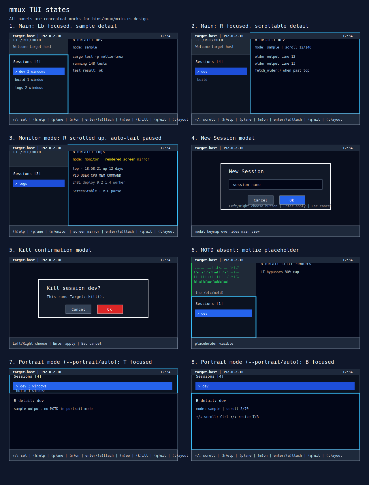

# mmux Design

## Status

Draft.

## Changelog

| Date | Who | Summary |
|------|-----|---------|
| 2026-04-27 | @gpt55-dgx | Renamed the selector executable and docs to `mmux`, including ForceCommand examples and mock asset references. |
| 2026-04-27 | @gpt55-dgx | Updated Sessions title format to `Sessions [n] @ <hostname>, <ip address>` and removed the `keys` label from the status bar. |
| 2026-04-27 | @gpt55-dgx | Moved host label from the status bar into the Sessions pane title. |
| 2026-04-27 | @gpt55-dgx | Replaced directional words in status hints with arrow symbols and expanded the `h` help modal with key functions. |
| 2026-04-27 | @gpt55-dgx | Changed portrait mode default T/B split from 40:60 to 30:70. |
| 2026-04-26 | @gpt55-dgx | Added an `h` About modal that shows the built-in motlie logo and the build git SHA; Enter or Esc closes it. |
| 2026-04-26 | @gpt55-dgx | Removed focus labels from the status bar because focused panes are already indicated by border styling. |
| 2026-04-26 | @gpt55-dgx | Updated status bar contract: omit layout labels from the status text and render the bar with a blue background. |
| 2026-04-26 | @gpt55-dgx | Finalized the CLI mode contract: default mode is attach-and-reenter selector behavior, and `--script` replaces `--print-session` / `--dashboard` for shell integration. |
| 2026-04-26 | @gpt55-dgx | Added `--portrait/-p` and `--landscape/-l` force flags and changed auto-detection to `columns / rows <= 4.0`, making 66x30 portrait. |
| 2026-04-26 | @gpt55-dgx | Set portrait auto-detection to the clean `columns / rows <= 2.0` rule and embedded the `/tmp/motlie-TOP-CHOICE.txt` glyph as the MOTD-absent fallback icon. |
| 2026-04-26 | @gpt55-dgx | Replaced short mode with portrait mode: `--portrait` is the explicit override, startup auto-detects portrait layout from PTY dimensions, the old `-s` flag is no longer accepted, and the MOTD fallback logo uses the requested Claude artifact ASCII art. |
| 2026-04-26 | @gpt55-dgx | Updated implemented keymap and rendering details: attach is Enter/`a`, Right/Left move focus between list and detail/monitor panes, Shift-arrow resize is documented for macOS iTerm2, sample detail preserves ANSI color, session-list refresh is polling-backed snapshot reconciliation, and narrow MOTD fallback stays graphical. |
| 2026-04-26 | @gpt55-dgx | Initial DESIGN for GitHub issue #226: local/remote tmux session selector TUI, session detail sources, monitoring mode, modal create/kill flows, accepted current-PTY attach gap, host-wide SSH integration, and SVG mock. |
| 2026-04-26 | @gpt55-dgx | Accepted PR #227 review additions from @opus47-macos-tmux: live session-list event stream via tmux control-mode notifications; focus model with `l` / `v` / `Esc` and visual focus borders; both panes scrollable with R-pane resample-backwards; bold-green motlie ASCII placeholder when MOTD absent (LT bypasses 30% cap to fit); PTY handoff non-functional requirement (no VTE-in-middle); spawn-and-wait attach with `setpgid`+`tcsetpgrp` signal hygiene; default-attach polarity with opt-in `--print-session` and opt-in `--dashboard` (re-enter on clean detach, bounded by `child.status.success()` AND list refresh AND user pick); two new accepted library gaps (`HostHandle::watch_host_events()`, `ScrollbackQuery::LinesRange`); alternatives B/C moved to appendix; testing-strategy additions; open-questions resolutions. |
| 2026-04-26 | @gpt55-dgx | Accepted PR #227 short-mode review addition from @opus47-macos-tmux: short-mode layout via `-s` flag, optimized for 32×65 terminals (mobile SSH clients, IDE terminals, tmux pop-ups). Vertical T/B split at 40:60 (T = session list, B = detail), default focus T. MOTD/motlie omitted in short mode for density. Resize keys promoted to Ctrl-modifier: `Ctrl-Up`/`Ctrl-Down` resize T/B in short mode; `Ctrl-Left`/`Ctrl-Right` resize L/R in normal mode (replacing plain `Left`/`Right`, which become reserved in main view). All other keys (`l`/`v`/`Esc`/`m`/`n`/`k`/`g`/Enter/`Ctrl-C`) and modal behavior identical across modes. |
| 2026-04-26 | @gpt55-dgx | Closed remaining PR #227 design-feedback decisions: main-view plain Left/Right stay reserved no-ops, short-mode status hints use ASCII-first compact labels, monitor history is fixed at 10,000 lines for v1, and the SVG mock now covers all required selector states. |
| 2026-04-26 | @gpt55-dgx | Addressed PR #227 re-review: added missing PLAN/API/CLI docs and pinned monitor historical fetch, kill-by-session-id, and monitored-session-close behavior. |
| 2026-04-26 | @gpt55-dgx | Addressed PR #227 round-3 cross-doc consistency feedback: aligned host events with API (`session_id`, no window-level variants), changed detail activation to `SelectedSession`, and documented stable session-id dispatch as a fourth library gap. |
| 2026-04-26 | @gpt55-dgx | Updated the MOTD-absent default placeholder art to the compact motlie glyph supplied for `/etc/motd` fallback. |
| 2026-04-26 | @gpt55-dgx | Replaced the MOTD-absent default placeholder with the full-width MOTLIE glyph supplied for `/etc/motd` fallback. |
| 2026-04-26 | @gpt55-dgx | Incorporated validation feedback: `q` exits like `Ctrl-C`, Ctrl-arrow resize accepts terminals that send extra modifiers, detail-pane scroll direction follows terminal convention and shows a scrollbar/range indicator, monitor mode strips raw ANSI/control bytes for TUI rendering, and dashboard re-enters after detach when the selected session still exists. |
| 2026-04-26 | @gpt55-dgx | Incorporated second validation feedback: monitor mode now mirrors rendered screen content through `capture_all_with_options(ScreenStable)` plus `ansi-to-tui`/VTE parsing, modified-arrow resize accepts terminal fallback sequences, and attach foreground-process-group restore ignores `SIGTTOU` to avoid stopped selector jobs after detach. |

## Product Scope

This is a greenfield product surface. The repository already has `motlie-tmux`
and `motlie-driver`, but `mmux` is a new user-facing binary with no
compatibility or migration burden. Backward compatibility for an older selector
CLI is out of scope.

The binary is intended for two use cases:

1. A host-local SSH entrypoint that replaces the login shell with a tmux session
   selector.
2. A local operator tool that can target another host by SSH URI, inspect that
   host's tmux sessions, and attach interactively to the chosen remote session.

## Problem

Users who SSH into a shared host need a fast, constrained way to choose an
existing tmux session, preview it, create a new session, kill a stale session,
and attach to the chosen session. The same selector should also work as an
operator tool for monitoring and attaching to a remote host from a different
machine.

Plain `tmux ls` followed by manual `tmux attach` is not enough because:

- it does not provide target-host context such as `/etc/motd`
- it does not preview or monitor a highlighted session before attach
- it cannot be installed as a complete host-wide selector without shell glue
- ad hoc shell glue would duplicate tmux/SSH command construction already owned
  by `motlie-tmux`

## Non-Goals

- No web UI.
- No migration path from a previous selector.
- No direct tmux command parsing or shelling in the binary for operations that
  `motlie-tmux` owns.
- No built-in session summarizer in the initial version. The `R` pane is designed
  so a summarizer can replace the sampled-content provider later.
- No policy engine for arbitrary remote target authorization. The design calls
  out where deployment policy must constrain SSH targets.

## Requirements

### Functional

- The TUI body is split into a left pane `L` and right pane `R`.
- `L` is split into upper `LT` and lower `LB`.
- `LT` displays the target host `/etc/motd`.
- `LT` height is dynamic: enough lines to show MOTD content, capped at 30% of
  the left-pane height. `LB` receives the remaining height.
- When `/etc/motd` is missing,
  empty, or unreadable, `LT` renders a built-in bold-green motlie glyph
  placeholder followed by a `(no /etc/motd)` caption (or
  `(motd unavailable: <reason>)` on read failure). In this case `LT` height
  bypasses the 30% cap and expands to exactly fit
  `glyph_rows + caption_row + chrome` when space allows. When `L_width < 63`
  columns or there is not enough vertical room to expand, keep the same
  motlie glyph plus `(no /etc/motd)` caption (still bold-green), not a
  text-only placeholder. The glyph asset is baked into the binary as a
  `&'static str` value (no inline ANSI
  escapes); styling is applied at render time via ratatui
  `Style { fg: Color::Green, add_modifier: Modifier::BOLD }`. Asset glyphs
  (use exactly):

  ```text
                   _   _ _
   _ __ ___   ___ ┃ ┃_┃ (_) ___   ╲╲ ║ ╱╱
  ┃ '▄ ` ▄ ╲ ╱ ▄ ╲┃ ▄▄┃ ┃ ┃╱ ▄ ╲  ══ ╬ ══
  ┃ ┃ ┃ ┃ ┃ ┃ (_) ┃ ┃_┃ ┃ ┃  __╱  ╱╱ ║ ╲╲
  ┃▄┃ ┃▄┃ ┃▄┃╲▄▄▄╱ ╲▄▄┃▄┃▄┃╲▄▄▄┃
  ```
- `LB` lists tmux sessions on the target host and has default focus.
- `LB` and `R` are both scrollable.
  `LB` viewport scrolls automatically to keep the highlighted row visible when
  `len(sessions) > visible_rows`. A position indicator (e.g., `5/12`) is shown
  in `LB` chrome or in the status bar.
- Up and Down move the highlighted session in `LB` *when focus is `Lb`*.
  When focus is `R`, Up/Down scroll
  the `R` content one line; `PgUp`/`PgDn` page through; `Home`/`End` jump to
  top/bottom of the buffer. When focus is `Lb`, `PgUp`/`PgDn` page through the
  session list and `Home`/`End` jump to first/last session.
- `Ctrl-Left` and `Ctrl-Right` resize the `L` / `R` split in the normal main
  selector view. The implementation also accepts terminal fallback
  modified-arrow sequences such as Alt/Shift arrows and word-left/word-right
  when a client does not report Ctrl-arrow distinctly. On macOS iTerm2, manual
  validation observed `Shift-Left` and `Shift-Right` for L/R resize. Plain
  Right moves focus from `Lb` to `R`; plain Left moves focus from `R` back to
  `Lb`.
- `R` initially shows sampled detail for the highlighted session.
- `R` detail is supplied through a trait so future view models can summarize or
  otherwise transform session content.
- When focus is `R` in sample mode
  and the user scrolls past the top of the currently sampled buffer, the
  detail source must resample backwards: fetch additional scrollback for the
  highlighted session, prepend it to the buffer, and anchor the viewport so
  the user's scroll position stays on the same line of content (no visual
  jump). Per-page fetches must be chunked, not full-buffer rebuilds.
- When focus is `R` in monitor
  mode and the user scrolls up, auto-tail pauses; newly received history is
  appended to the buffer but the viewport stays anchored at the user's
  position. `End` (or jump-to-bottom key) re-engages auto-tail.
- Pressing `m` puts `R` into monitoring mode for the highlighted session, using
  `motlie-tmux` rendered screen capture (`capture_all_with_options` with
  `CaptureNormalizeMode::ScreenStable`) plus VTE/ANSI parsing to show live
  screen snapshots. This is intentionally a screen mirror, not raw tmux
  control-mode `%output` replay, because TUI programs rely on cursor movement,
  clearing, and repaint semantics. (Focus-independent: operates on the
  highlighted session regardless of which pane has focus.)
- Pressing `n` opens a centered `New Session` modal with a session-name text
  field and `Cancel` / `Ok` buttons.
- Pressing `k` opens a centered `Kill session <name>?` confirmation modal with
  `Cancel` / `Ok` buttons.
- Pressing `h` opens a centered help modal with the built-in motlie logo,
  key-function reference text, the current build git SHA, and an `Ok` button.
  The key-function reference renders below the logo and above the `Ok` button.
- In create/kill modal dialogs, Left and Right choose between `Cancel` and
  `Ok`; Enter exits the modal and applies `Ok` when selected. `Esc` in a modal
  is `Cancel` and closes without applying. In the help modal, Enter or `Esc`
  closes the modal without changing selector state.
- Pressing Right moves focus from
  `Lb` to `R` (no-op if already `R`). Pressing Left moves focus from `R` to
  `Lb` (no-op if already `Lb`). Outside any modal, `Esc` is equivalent to
  Left when focus is `R`, and is a no-op when focus is `Lb` (use `q` or
  `Ctrl-C` to exit). The currently focused pane must be visually distinguished from the
  unfocused pane via border style — a bright/colored or doubled border for
  the focused pane, dim/single for the unfocused. The status bar does not
  duplicate focus state.
- Pressing `a` or Enter in the main selector exits the TUI and attaches the
  current user PTY to the highlighted session. (Focus-independent: attach
  always operates on the `Lb` highlight regardless of which pane has focus.)
- Pressing `q` exits the selector without attach, equivalent to `Ctrl-C` in
  the main selector view.
- The binary accepts an optional SSH URI / host target. Omitted means local host.
- For SSH targets, listing, MOTD, sampling, create, kill, monitor, and attach
  all operate against the SSH target.
- For SSH targets, attach must open an interactive SSH PTY to the target host
  and attach that remote PTY to the selected remote tmux session.
- The session-list pane title shows the target host and session count as
  `Sessions [n] @ <hostname>, <ip address>`.
- A bottom status bar shows current time and supported keys.
  Key hints must use arrow symbols instead of spelling out `up`, `down`,
  `left`, or `right`, and must include navigation between list and detail
  (`←/→`) plus always-on hints (`m monitor`, `n new`, `k kill`, `h help`,
  attach, resize, `q quit`). The status bar must not show a `keys` label,
  focus (`list`, `detail`, `Lb`, `R`), or layout mode (`portrait`,
  `landscape`, or `normal`) and must render with a blue background.
- The selector must keep `LB`
  consistent with the target host's tmux state without user-driven refresh,
  by subscribing at startup to a host-level event stream. In the current
  implementation that stream polls `list_sessions()` once per second and
  reconciles snapshots by stable session id (not name). Direct tmux
  control-mode host notifications remain a future hardening item; see
  §Data Flow → Live Session List and §Accepted motlie-tmux Library Gaps →
  Host Event Stream.
- Default mode (no behavior flag): on `a` or Enter, leave the TUI cleanly and
  spawn-and-wait attach (see §Data Flow → Attach). Default mode re-enters the
  TUI on clean child exit, or on non-zero child exit when the selected session
  still exists (see §Data Flow → Attach for the bounded re-entry rule). When
  invoked with `--script`, the binary instead leaves the TUI cleanly, prints
  the selected session name (and only the session name) followed by a newline to
  stdout, and exits 0; cancellation (`q`/`Ctrl-C`, no selection) exits non-zero
  with no stdout. All UI rendering, status, and errors go to stderr only.
- The binary accepts explicit layout force flags: `--portrait` / `-p` and
  `--landscape` / `-l`. The flags are mutually exclusive. Portrait mode
  renders a compact layout optimized for 32 rows x ~64
  columns: the body splits vertically into Top (`T`, default focus, lists
  sessions) and Bottom (`B`, detail pane) at a 30:70 ratio. MOTD and the
  motlie placeholder are omitted in portrait mode to maximize content density.
  All command keys (Left/Right focus, `Esc`/`m`/`n`/`k`/`a`/Enter/`q`/`Ctrl-C`), modal
  behavior, focus model semantics, and detail-source trait usage are
  identical to normal mode (mapping `T` ↔ `Lb` and `B` ↔ `R`). Resize keys
  differ by mode: portrait mode uses `Ctrl-Up`/`Ctrl-Down` to resize `T`/`B`;
  normal mode uses `Ctrl-Left`/`Ctrl-Right` to resize `L`/`R`, with
  modified-arrow fallback sequences accepted for terminal compatibility. Plain
  `Left`/`Right` move focus between list and detail/monitor in main view;
  modal use of `Left`/`Right` for button selection is unchanged. Without a
  layout force flag, the selector calls `crossterm::terminal::size()` on the
  connecting PTY and selects portrait mode when `columns / rows <= 4.0`;
  otherwise it uses landscape layout. If the PTY size cannot be read, it
  defaults to landscape layout. The layout force flags compose with `--script`
  and SSH targets.
- The binary must use `motlie-tmux` for tmux operations and must not duplicate
  tmux command logic in the binary.

### Non-Functional

- Terminal state must be restored on normal exit, attach, error, `q`/`Ctrl-C`, and
  panic paths.
- Monitor handles and subscriptions must be stopped/unsubscribed when leaving
  monitoring mode, changing monitored session, killing the monitored session, or
  exiting the TUI.
- UI redraws must remain responsive while sampling or monitoring remote sessions.
- Session create/kill failures must be shown inline without corrupting the
  terminal state.
- The app must be usable as an SSH `ForceCommand` entrypoint.
- All accepted `motlie-tmux` library gaps must be implemented in the library,
  not worked around by shell command duplication in the binary.
- The attach handoff must transfer
  the user's controlling terminal directly to the attached `tmux` (or
  `ssh tmux`) process. The selector binary must not run a nested terminal
  emulator, VTE buffer, or byte-proxy between the user's PTY and the
  attached process. Concretely: before handoff the selector stops monitor
  state, leaves the alternate screen, and restores termios; for local
  targets it spawns `tmux attach-session -t <name>` as a child with
  inherited stdio (`stdin`/`stdout`/`stderr`); for SSH targets it spawns
  `ssh -t [...] tmux attach-session -t <name>` with inherited stdio. No
  `pipe()` wrapping. No re-read into the binary's TUI. See §Data Flow →
  Attach and §Accepted Library Gaps → Current PTY Attach.
- `R`-pane scroll-back fetches
  must be chunked per page, not full-buffer rebuilds, so SSH-target detail
  panes remain responsive on long-lived sessions. See §Accepted Library
  Gaps → ScrollbackQuery::LinesRange.
- Monitor mode is bounded to the rendered current screen. It does not retain a
  raw control-mode transcript in the selector binary, preventing unbounded
  memory growth on busy sessions. Older detail requests use chunked tmux
  scrollback fetches via `LinesRange`.

## System Design

```text
current terminal / SSH client PTY
        |
        v
mmux binary
        |
        +-- TargetConnection
        |      +-- local: HostHandle::local()
        |      +-- ssh:   SshConfig::parse(uri)?.connect().await?
        |
        +-- SessionStore
        |      +-- HostHandle::list_sessions()
        |      +-- HostHandle::create_session()
        |      +-- HostHandle::session_by_id(id).await?       // -> Option<Target>
        |          .ok_or(SessionVanished)?                   // race: see below
        |          .kill().await?
        |
        +-- MotdSource
        |      +-- local read /etc/motd
        |      +-- remote HostHandle::download(/etc/motd, temp)
        |
        +-- DetailPane
        |      +-- SampleDetailSource
        |      +-- MonitorDetailSource
        |
        +-- Attach
               +-- Target::attach_current_pty()  [accepted motlie-tmux gap]
```

The selector keeps all tmux state behind the connected `HostHandle`. This is the
main layering rule: UI code may decide when to list, sample, create, kill, or
attach, but it does not know how tmux commands are spelled.

## Target Model

```rust
enum TargetConnection {
    Local {
        host: motlie_tmux::HostHandle,
        label: String,
    },
    Ssh {
        uri: String,
        host: motlie_tmux::HostHandle,
        label: String,
    },
}
```

The CLI accepts:

```text
mmux
mmux ssh://user@host
mmux 'ssh://user@host?identity-file=/path/to/key'
```

The accepted v1 CLI target form is a positional SSH URI:
`mmux [ssh-uri]`. Do not add `--target` in v1; keeping a single target
form keeps help text and ForceCommand examples unambiguous. Revisit in a
follow-up only if PLAN finds positional friction with deployment tools.

Additional flags:

| Flag | Behavior |
|------|----------|
| (none) | Default. TUI → select → spawn-and-wait attach (see §Data Flow → Attach). On clean child exit, re-enter the TUI; on non-zero child exit, re-enter only if the selected session still exists, otherwise exit with the child's status. `q`/`Ctrl-C` from the re-entered TUI exits 0 (user-initiated clean exit). |
| `--script` | TUI → select → leave alt-screen → print `<name>\n` to stdout → exit 0. Cancellation exits non-zero with empty stdout. All UI/diagnostics on stderr. Composable: `tmux attach -t "$(mmux --script)"`. |
| `--portrait` / `-p` | Force portrait layout: vertical T/B split (30:70) optimized for 32x64 terminals. MOTD omitted. Same command keys, modal behavior, focus model, and detail sources as normal mode. Resize via `Ctrl-Up`/`Ctrl-Down`. Composes with `--script` and SSH targets. Without a layout force flag, layout is auto-detected from PTY dimensions. See §Layout → Portrait Mode. |
| `--landscape` / `-l` | Force landscape/normal layout: `L`/`R` split with `LT` MOTD and `LB` session list. Composes with `--script` and SSH targets. Mutually exclusive with `--portrait` / `-p`. |
| `--portrait` + `--landscape` | Mutually exclusive — startup error. |

Polarity rationale (default attach/re-enter): the binary's primary product is a
host-wide session selector that keeps users inside the selector workflow across
tmux detaches. Shell-script composition is opt-in via `--script`, which makes
stdout ownership explicit.

ForceCommand-mode incompatibility: `--script` is incompatible with ForceCommand
mode (the user has no shell to consume the output). ForceCommand deployments
must omit the flag; the binary should warn (stderr) on a best-effort heuristic
if both are detected.

## Layout

The terminal is split into:

- body area: everything except the bottom status bar
- status bar: one terminal row

The body area is split horizontally into `L` and `R`.

`L` is split vertically:

- `LT`: MOTD, height `min(rendered_motd_lines + chrome, 30% of L height)`
  when MOTD is present. When MOTD
  is absent/empty/unreadable, `LT` height = `glyph_rows + caption + chrome`
  (bypasses the 30% cap so the motlie placeholder fully renders); narrow-
  terminal fallback collapses `LT` to a single line. See §Functional
  Requirements for the placeholder rendering rule.
- `LB`: session list, remaining height. The viewport scrolls to keep the
  highlighted row visible. A position indicator is shown.

**Focus model.** The main view has
two focus states: `Lb` (default) and `R`. Focus transitions are explicit:

- Right → focus `R` (no-op if already `R`)
- Left → focus `Lb` (no-op if already `Lb`)
- `Esc` outside any modal: equivalent to Left when focus is `R`; no-op when
  focus is `Lb` (use `q` or `Ctrl-C` to exit). `Esc` inside any modal is equivalent
  to that modal's `Cancel` button.

The currently focused pane must be visually distinguished from the unfocused
pane via border style (bright/colored or doubled for focused; dim/single for
unfocused). The blue status bar shows time and key hints only; it does not
duplicate host, focus, layout state, or a `keys` label. The target host appears
in the Sessions pane title as `Sessions [n] @ <hostname>, <ip address>`.

Main-selector keymap (focus-aware):

| Key | `Lb`-focused | `R`-focused |
|-----|--------------|-------------|
| Up / Down | Move highlight; LB viewport auto-scrolls | Scroll R one line; on scroll-past-top, sample mode resamples backwards (chunked); monitor mode pins viewport (auto-tail pauses) |
| PgUp / PgDn | Page through session list | Page through R buffer |
| Home / End | First / last session | Top / bottom of buffer; `End` re-engages monitor auto-tail |
| Left | (no-op) | Focus → `Lb` |
| Right | Focus → `R` | (no-op) |
| `Esc` | (no-op outside modal; `Cancel` inside modal) | Focus → `Lb` (outside modal); `Cancel` inside modal |
| Modified Left / Right | Resize `L`/`R` split (normal mode only; `Ctrl`, Alt, Shift, and word-arrow fallbacks accepted when terminals remap Ctrl-arrow) | Resize `L`/`R` split (normal mode only; focus-independent) |
| `m` | Start/switch monitoring on highlight | Same |
| `n` | Open `New Session` modal | Same |
| `k` | Open kill-confirmation modal | Same |
| `h` | Open help modal with logo, key functions, and build git SHA | Same |
| Enter / `a` | Attach highlight | Attach highlight (focus-independent) |
| `q` / `Ctrl-C` | Exit selector without attach | Exit selector without attach |

Resize keys use modified arrows so plain arrows are unambiguously reserved for
navigation, scrolling, and focus movement. Normal mode advertises
`Ctrl-Left`/`Ctrl-Right` for the L/R split and also accepts common terminal
fallbacks; on macOS iTerm2 the observed fallback is `Shift-Left` /
`Shift-Right`. Portrait mode advertises `Ctrl-Up`/`Ctrl-Down` for the T/B split
and accepts the same modifier family.

Modal keymaps override the main keymap. In modals: Left/Right move between
`Cancel` and `Ok`; `Enter` exits and applies `Ok` if selected; `Esc` is
`Cancel`.

### Portrait Mode

Portrait mode is optimized for compact terminal contexts where horizontal width is
constrained: mobile SSH clients, IDE-embedded terminals, tmux pop-ups
(`display-popup`), and narrow ForceCommand deployments.

**Target dimensions:** 32 rows x ~64 columns. The layout must remain usable
at smaller sizes but is tuned for this target.

**Layout:**

- Body area: 31 rows (32 total minus 1 status-bar row).
- Body splits *vertically* into Top (`T`) and Bottom (`B`) at a 30:70 ratio
  (T ≈ 9 rows, B ≈ 22 rows for a 32-row terminal).
- `T` = session list. Equivalent to `LB` in normal mode (same scrolling,
  same position indicator, same auto-scroll-to-keep-highlight-visible
  behavior). Default focus.
- `B` = detail pane. Equivalent to `R` in normal mode (same trait-backed
  sample/monitor sources, same scroll-back-on-up, same monitor tail-pause).
- MOTD (`LT`) and the motlie placeholder are **omitted** in portrait mode to
  maximize content density. Status-bar key hints remain, but key hints must be
  terser to fit ~64 cols. Use compact symbol labels for directional keys,
  e.g., `↑/↓ select | ←/→ pane | m monitor | n new | k kill | h help | Enter/a go`.

**Focus model:** Identical to normal mode, with `T` ↔ `Lb` and `B` ↔ `R`:

- Default focus is `T`.
- Right → focus `B` (no-op if already `B`).
- Left → focus `T` (no-op if already `T`).
- `Esc` outside modal: equivalent to Left when focus is `B`; no-op when focus
  is `T`.
- Visual focus borders: same rule (bright/doubled for focused; dim/single
  for unfocused).

**Resize keys (mode-dependent):**

| Key | Normal mode | Portrait mode |
|-----|-------------|------------|
| Modified Left / Right | Resize `L`/`R` split | (no-op; `L`/`R` not present) |
| Modified Up / Down | (no-op; `T`/`B` not present) | Resize `T`/`B` split |
| Plain arrows (no Ctrl) | Navigation/scroll per focus-aware keymap above | Navigation/scroll per focus-aware keymap above (same — use `T`/`B` in place of `Lb`/`R`) |

**All other keys and modal behavior:** identical to normal mode (see the
focus-aware keymap above). `m`, `n`, `k`, `a`/Enter, `q`/`Ctrl-C` are
focus-independent and behave the same. `q`/`Ctrl-C` exits without attaching.
Modal keymap (Left/Right for button
selection, Enter to apply, Esc to Cancel) is unchanged.

**Auto-detection and composition:** Without `--portrait` / `-p` or
`--landscape` / `-l`, startup reads the current PTY size through
`crossterm::terminal::size()`. It selects portrait mode when
`columns / rows <= 4.0`; 66x30, 80x24, 100x30, 160x40, and square-ish PTYs use
portrait mode. Wider PTYs use landscape mode. If the size cannot be read,
landscape mode is used. Layout force flags compose with `--script`, SSH
targets, and the `MOTLIE_MMUX_BYPASS` env-var
admin bypass. ForceCommand deployments may use explicit layout flags for fixed
display contexts (`ForceCommand /usr/local/bin/mmux --portrait`
or `ForceCommand /usr/local/bin/mmux --landscape`).

## SVG Mock

The DESIGN mock source is checked in beside this document:



If GitHub issue rendering supports the chosen SVG embedding path, this same SVG
should be attached or linked from issue #226 after the branch is pushed.

The SVG mock includes the following panels:

1. Main selector view, `Lb`-focused.
2. Main selector view, `R`-focused.
3. Monitor mode with `R` scrolled up and auto-tail paused.
4. `New Session` modal.
5. Kill confirmation modal with title `Kill session <name>?`.
6. MOTD-absent state with bold-green motlie glyph placeholder.
7. Portrait mode main view with focused `T`.
8. Portrait mode focused-`B` variant.

## R Pane Detail Source

The `R` pane should depend on a trait, not directly on sampling or monitoring
implementation details.

```rust
pub struct SelectedSession {
    pub id: String,
    pub name: String,
}

#[async_trait::async_trait]
trait SessionDetailSource {
    async fn activate(
        &mut self,
        host: &motlie_tmux::HostHandle,
        session: &SelectedSession,
    ) -> anyhow::Result<()>;

    // DetailDelta replaces the
    // bare Option<String> so monitor mode can express "append" vs "replace"
    // semantics, and so the UI can know whether to scroll the viewport.
    // Some(Append(text))  — new content arrived (monitor); append at tail.
    // Some(Replace(text)) — full re-render (sample re-fetched on highlight).
    // None                — no change since last tick.
    async fn tick(&mut self) -> anyhow::Result<Option<DetailDelta>>;

    // Resample-backwards entry
    // point. UI calls this when focus is `R` and the user scrolls past the
    // top of the currently rendered buffer. Returns lines older than
    // `before_line` (where `before_line` is an index into the source's
    // current buffer's oldest line); up to `count` lines. Empty Vec means
    // "no more history available." `SampleDetailSource` implements this via
    // `Target::sample_text_with_options(&ScrollbackQuery::LinesRange { ... },
    // ScreenStable, None)` — see §Accepted Library Gaps.
    async fn fetch_older(
        &mut self,
        before_line: usize,
        count: usize,
    ) -> anyhow::Result<Vec<String>>;

    async fn deactivate(&mut self) -> anyhow::Result<()>;
}

pub enum DetailDelta {
    Append(String),
    Replace(String),
}
```

Initial shipped implementations:

- `SampleDetailSource`: resolves the selected session by stable id, captures
  session content with `sample_text_with_options(..., ScreenStable, ...)` so
  ANSI color/style escapes are preserved, then renders through
  `ansi-to-tui`'s VTE parser in `R`.
  `fetch_older` issues
  `Target::sample_text_with_options(&ScrollbackQuery::LinesRange { older_than_lines, count }, ScreenStable, None)`
  for paginated backwards fetch (see §Accepted Library Gaps →
  ScrollbackQuery::LinesRange).
- `MonitorDetailSource`: resolves the selected session by stable id, captures
  the rendered current screen for all panes through `capture_all_with_options`
  using `CaptureNormalizeMode::ScreenStable`, and renders ANSI with
  `ansi-to-tui`'s VTE parser in `R`. When the user scrolls up in monitor mode,
  auto-tail pauses; refreshes continue, but the UI viewport stays anchored at
  the user's position. `fetch_older` for monitor mode falls back to a one-shot
  `Target::sample_text_with_options(&LinesRange { ... }, ScreenStable, None)`
  against the same target. The
  monitor screen mirror is a current-screen source, not a rolling transcript
  source.

Implementation should prefer static dispatch for shipped modes:

```rust
enum DetailMode {
    Sample(SampleDetailSource),
    Monitor(MonitorDetailSource),
}
```

`DetailMode` can implement `SessionDetailSource`. This preserves a trait
boundary for future summary providers without forcing dynamic dispatch into the
initial hot path.

## Data Flow

### Startup

1. Parse CLI target and flags (`--portrait` / `-p`, `--landscape` / `-l`,
   `--script`; `--portrait` and `--landscape` are mutually exclusive — error
   on both).
2. Connect to local or SSH target with `motlie-tmux`.
3. Load target host MOTD (or render the motlie placeholder when absent).
4. List sessions.
5. Subscribe to host-level event
   stream (see §Live Session List). On subscribe failure, fall back to
   polling; emit a status-bar indicator so the user knows refresh is degraded.
6. Initialize UI state with `LB` focused and first session highlighted.
7. Render sample detail for the highlighted session, if any.

### Live Session List

The `LB` list must stay consistent with the target host's tmux state without
user-driven refresh. Other clients may create, kill, or rename sessions;
sessions may exit unexpectedly. The selector must reconcile.

Shipped v1 mechanism: `HostHandle::watch_host_events()` is a typed stream
backed by one-second polling. It performs an initial `list_sessions()`, then
calls `list_sessions()` every second, diffs the current snapshot against the
previous snapshot by stable session id, and emits typed add/close/rename and
client attach/detach events. On transient list failure it emits
`Disconnect { reason }` and retries on the next tick. This is poll-based
snapshot reconciliation, not direct tmux control-mode host notifications.

Future hardening target: tmux control-mode notifications. The library already
parses `%`-prefixed control-mode lines as `ControlModeMessage::Notification`
(`libs/tmux/src/monitor.rs:58–96`) but currently discards them
(`monitor.rs:337–341`). A later implementation can wire those notifications
into the same `HostEventStream` contract without changing the selector UI
model.

Subscribe-and-reconcile loop:

1. On startup (after initial `list_sessions()`), call
   `host.watch_host_events()` and spawn a tokio task to drain it.
2. On each event:
   - `SessionsChanged` / `SessionAdded` / `SessionClosed`: re-issue
     `list_sessions()` and merge into `LB` model by stable session id (not
     name — `%session-renamed` requires id-based identity;
     `SessionInfo.id` exists in `libs/tmux/src/types.rs:66`).
     If `SessionClosed { id }` matches the currently monitored session id,
     stop the monitor and clear `R` to a placeholder or empty state until the
     user's next explicit detail/monitor action.
   - `SessionRenamed { id, old, new }`: update display name in place; preserve
     highlight.
   - `ClientDetached { session_id }` / `ClientAttached { session_id }`:
     update `attached` flag.
   - `Disconnect { reason }`: polling list operation failed. Show status-bar
     indicator. Keep the existing snapshot and retry on the next one-second
     tick.
3. Reconciliation must preserve the user's highlight when possible: if the
   highlighted session id still exists, keep it highlighted; if it
   disappeared, move highlight to the next valid row (or to the previous if
   the highlighted row was the last).
4. Empty-list state (zero sessions): see §Empty Session List below.
5. In default attach/re-enter mode, the active TUI subscription is dropped
   before attach. On re-entry the selector takes a fresh `list_sessions()`
   snapshot and starts a new host-event subscription before the first redraw.

Polling semantics: re-issue `list_sessions()` every 1s through
`HostHandle::watch_host_events()`. The public stream is event-shaped for the
selector, but freshness is polling-backed in the current implementation.

### Empty Session List

When the target host has zero tmux sessions (at startup, or after a kill during
selector re-entry):

1. `LB` renders an inline placeholder row: `(no sessions on <host> — press n
   to create)`.
2. `R` renders nothing (or an inline hint mirroring the same `n to create`
   message).
3. Highlight is unset; `m`, `k`, `a`, `Enter` are all no-ops in this state.
4. `n` remains active and opens the New Session modal as usual.
5. ForceCommand mode treats this as the normal first-run path: the user
   creates their first session via `n`, which then becomes the highlight,
   and `Enter` attaches.

### Highlight Change

1. Up/Down (when focus is `Lb`) updates selected session index. The `LB`
   viewport scrolls to keep the highlighted row visible.
2. If `R` is in sample mode, refresh sample detail for the new session
   (replace buffer).
3. If `R` is in monitoring mode, keep monitoring the previous monitored session
   until the user presses `m` again. This avoids implicit monitor teardown when
   the user is only browsing.
4. When focus is `R`, Up/Down
   scroll the `R` content (no LB highlight movement). See §Layout keymap
   table.

### Monitoring Mode

1. Pressing `m` stops any existing monitor/detail source.
2. Start monitoring the highlighted session.
3. Resolve the highlighted session by stable id and capture its rendered screen
   using `capture_all_with_options(CaptureNormalizeMode::ScreenStable)`.
   Render ANSI through the VTE parser so TUI screen snapshots display without
   raw escape bytes.
4. Status bar shows the monitored session.
5. When focus is `R`, scrolling
   up pauses auto-tail; refreshes still replace the source's current-screen
   buffer but the viewport stays anchored. `End` re-engages auto-tail.
6. Killing the monitored session or exiting the TUI stops monitor state.

### New Session

1. Pressing `n` opens the modal.
2. User enters a name and selects `Ok`.
3. Call `HostHandle::create_session(name, &Default::default())`.
4. Refresh session list.
5. Highlight the created session.
6. Refresh `R` detail.

### Kill Session

1. Pressing `k` opens confirmation for the highlighted session.
2. User selects `Ok`.
3. On kill-modal-open, capture the stable session id from the highlighted
   `SessionInfo` and dispatch the kill against that id, not the display name.
   If the session was killed by another client between list and resolve,
   surface a brief inline status message ("session already gone") and let the
   host-event subscription's reconciliation refresh `LB` — do not error out.
4. Call `Target::kill()`. On error (connection dropped, permission), show
   inline error without corrupting terminal state.
5. Stop monitor state if it was monitoring that session.
6. Refresh immediately after a successful kill for responsive feedback; the
   polling-backed host-event stream will reconcile the same state on its next
   tick as a backstop.
7. Move highlight to the next valid row. If the killed session was the only
   one, transition to §Empty Session List state.

### Attach

The attach handoff transfers the user's controlling terminal directly to
the spawned tmux (or `ssh tmux`) child. **No VTE-in-the-middle.**

1. Pressing Enter or `a` in the main selector (any focus) records the
   highlighted session id.
2. Stop monitor/detail state. Drop the active host-event subscription; re-entry
   starts from a fresh session snapshot.
3. Restore raw mode and leave the alternate screen. Restore termios to
   canonical state.
4. Resolve the highlighted session id to a `Target` via the stable-id
   library path. If the session vanished between selection and resolve
   (race), show stderr message and re-enter the TUI.
5. **Spawn-and-wait** with inherited stdio:
   - Local target: spawn `tmux attach-session -t <name>` (using socket /
     resolved tmux binary as needed) as a child with inherited
     stdin/stdout/stderr. No `pipe()`. No proxy.
   - SSH target: spawn `ssh -t [opts] <host> tmux attach-session -t <name>`
     with inherited stdio.
   - Put the child in its own process group via `setpgid` immediately after
     fork (or via `Command::process_group(0)`). Set the foreground process
     group via `tcsetpgrp` so foreground signals (`SIGINT`, `SIGTSTP`,
     `SIGWINCH`) reach the child, not the parent.
6. Call `wait()` (parent blocks while child holds the terminal).
7. On `wait()` return, branch on mode and child exit status:

   ```text
   wait() returns
       │
       ├── --script ───────→ (unreachable; --script bypasses attach)
       │
       └── default mode ───→ if child.status.success()
                                 or selected session still exists:
                                 re-enter TUI:
                                   1. re-acquire alt-screen, raw mode
                                   2. refresh list_sessions()
                                   3. start a new host-event subscription
                                   4. re-render LB (state may have changed)
                                   5. if list_sessions() refresh fails →
                                        exit with that error (bounded loop:
                                        no infinite re-entry on broken target)
                                 else (non-zero child exit and selected
                                 session is gone):
                                   exit with child.status.
                                 q/Ctrl-C from re-entered TUI exits the
                                 binary with code 0 (user-initiated).
   ```

8. Detach status is treated conservatively. Some tmux/SSH attach paths can
   report non-zero even when the user detached and the selected session still
   exists. Default mode therefore uses child success as sufficient for
   re-entry, and for non-zero exits probes the selected session id before
   deciding whether to re-enter or propagate the child status.

9. Process count footprint: two processes are resident during the attach window
   (selector + child). Under exec-replace this would be one, but exec-replace
   forecloses recovery, observability, and testability — rejected.

## Accepted motlie-tmux Library Gaps

### Current PTY Attach

Issue #226 accepts adding a foreground attach capability to `motlie-tmux`.

API:

```rust
pub struct AttachExit {
    pub status: std::process::ExitStatus,
}

impl Target {
    pub async fn attach_current_pty(&self) -> Result<AttachExit>;
}
```

Required semantics:

- Session targets attach that session.
- Window/pane targets should either attach their parent session and select the
  target, or return a typed unsupported-target error. The selector only needs
  session-level attach.
- Local targets run the correct tmux attach path while preserving socket and
  resolved-binary behavior.
- SSH targets open an interactive SSH PTY to the remote host and run the correct
  remote tmux attach path there.
- The API owns tmux and SSH command construction; the binary does not.
- Implementation must be
  spawn-and-wait, not exec-replace: spawn the child with inherited stdio,
  put it in its own process group via `setpgid` (e.g., via Rust's
  `std::os::unix::process::CommandExt::process_group(0)` or equivalent),
  set the foreground process group via `tcsetpgrp`, then `wait()`. Return
  the child's `ExitStatus` (translate signal-terminated to `128 + signal`).
  Rationale: spawn-and-wait preserves recovery on post-list/pre-attach
  failure (race, SSH transient, vanished target), enables per-attach
  lifecycle logging for ForceCommand fleet ops, and keeps the API
  testable with standard Rust subprocess patterns. Exec-replace is rejected.

### Host Event Stream

The selector requires a host-level event stream to keep `LB` consistent with
the target's tmux state without user-driven refresh (see §Functional
Requirements and §Data Flow → Live Session List).

Implemented v1 behavior: `watch_host_events()` is a polling-backed typed event
stream. It reconciles `list_sessions()` snapshots once per second by stable
session id and emits `SessionAdded`, `SessionClosed`, `SessionRenamed`,
`ClientAttached`, `ClientDetached`, and `Disconnect` events. It does not yet
open a host-scoped tmux control-mode notification connection.

API shape:

```rust
impl HostHandle {
    pub async fn watch_host_events(&self) -> Result<HostEventStream>;
}

pub enum HostEvent {
    SessionsChanged,                                  // %sessions-changed
    SessionAdded { id: String, name: String },        // derived
    SessionClosed { id: String, name: String },       // derived
    SessionRenamed { id: String, old: String, new: String },
    ClientAttached { session_id: String },
    ClientDetached { session_id: String },
    Disconnect { reason: String },                    // event source/listing failed
}
```

Future implementation target: open a single shared `tmux -C` connection per
host (e.g., `tmux -C new-session -d -s motlie-events` or attach to a
long-lived sentinel session), surface the already-parsed `Notification` lines
as typed `HostEvent`s. Reconnect transparently on transient drops; emit
`Disconnect { reason }` and reconnect events at the boundaries.

Recommended over the alternative (extending `OutputBus` with a host-level
variant) because the alternative couples host events to per-session monitor
lifetime — which breaks when there are no sessions (the empty-list state
must still receive `SessionAdded`).

### ScrollbackQuery::LinesRange

The `R` pane's resample-backwards behavior (see §Functional Requirements and
§R Pane Detail Source) requires a windowed scrollback fetch.

Today, `ScrollbackQuery` (`libs/tmux/src/types.rs:660–668`) supports only:

```rust
pub enum ScrollbackQuery {
    LastLines(usize),
    Until { pattern: Regex, max_lines: usize },
    LastLinesUntil { lines: usize, stop_pattern: Regex },
}
```

None supports a windowed/range fetch ("lines older than offset K, up to N
lines"). The selector could simulate it by re-issuing
`LastLines(prev_total + chunk)` and discarding overlap, but this re-fetches
the entire history each step — O(N²) bandwidth over SSH. Unacceptable for
long-lived sessions.

API shape:

```rust
pub enum ScrollbackQuery {
    LastLines(usize),
    Until { pattern: Regex, max_lines: usize },
    LastLinesUntil { lines: usize, stop_pattern: Regex },
    // new
    LinesRange { older_than_lines: usize, count: usize },
}
```

Semantics: return up to `count` lines older than `older_than_lines`, where
`older_than_lines` is anchored at the current capture tail. If the detail pane
already has 200 lines loaded and needs the previous page, it requests
`LinesRange { older_than_lines: 200, count: page_size }`. Empty result means
"no more history available." Used by `SampleDetailSource::fetch_older` and
`MonitorDetailSource::fetch_older`; monitor mode uses the same tmux capture
history anchor and does not treat the rolling monitor buffer as the source of
truth for historical fetches.

### Stable Session-Id Dispatch

The selector captures `SessionInfo.id` for destructive operations, attach, and
detail-source activation. Display names can change while a modal is open or
while the user is browsing sessions, so resolving by name is not sufficient.

API shape:

```rust
impl HostHandle {
    pub async fn session_by_id(&self, id: &str) -> Result<Option<Target>>;
}
```

The library owns id-to-target resolution so the binary does not duplicate
tmux discovery or command construction. If tmux cannot address a session by id
directly for a needed operation, the library must perform the safe lookup and
race handling internally before returning `Target`.

### Remote MOTD

The binary can use existing `HostHandle::download(remote, local, opts)`
(`libs/tmux/src/host.rs:522`) to retrieve `/etc/motd` from SSH targets into
a temporary local file. The
fallback rationale below is concrete: `download()` requires temp-file
lifecycle management (create, write, read-back, cleanup), and `/etc/motd`
files of unbounded size could waste disk. If those concerns prove
material in PLAN, the narrower library addition should be a host-level
text-file read helper:

```rust
impl HostHandle {
    pub async fn read_text_file(&self, path: &std::path::Path) -> Result<String>;
}
```

This is not accepted yet as a required gap; it is a design fallback if the
existing file-transfer API is too awkward or unsafe for MOTD.

## Host-Wide SSH Integration

The local-host deployment target is `ForceCommand`.

```text
Match Group tmux-users
    PermitTTY yes
    ForceCommand /usr/local/bin/mmux
```

Operational behavior:

1. `sshd` allocates the user's PTY.
2. `sshd` starts `mmux` instead of the login shell.
3. The selector targets the local host unless deployment passes an allowed SSH
   target argument.
4. User selects, monitors, creates, kills, or attaches.
5. On attach, the selector restores terminal state and hands the PTY to the
   selected tmux session.

Deployment policy must decide:

- which Unix users/groups are subject to the selector
- whether `SSH_ORIGINAL_COMMAND` is rejected, ignored, or used as an admin
  bypass
- whether remote target arguments are allowed in ForceCommand deployments
- how admins bypass the selector for maintenance

Recommended initial deployment policy:

- ForceCommand mode targets local host only.
- Operator-invoked CLI mode may pass an SSH URI.
- `SSH_ORIGINAL_COMMAND` is rejected with a clear message unless an explicit
  admin bypass is configured outside the binary.

Concrete admin-bypass mechanism:
the binary reads the environment variable `MOTLIE_MMUX_BYPASS` at
startup. If unset or empty, `SSH_ORIGINAL_COMMAND` is rejected with a stderr
message and the binary exits non-zero. If set to `1` (or any non-empty
value), the binary exec's `SSH_ORIGINAL_COMMAND` via the user's login shell
(`/bin/sh -c "$SSH_ORIGINAL_COMMAND"`) and bypasses the TUI entirely.
Deployments enable this by adding `AcceptEnv MOTLIE_MMUX_BYPASS` to
`sshd_config` for the relevant `Match Group` (or by setting the variable
via PAM/login.defs for specific users/groups). This keeps the bypass
configuration external to the binary while giving PLAN a concrete
mechanism to implement and test.

ForceCommand deployments must
NOT use `--script` (the user has no shell to consume stdout).
Recommended deployments:

```text
# Default: TUI selector with attach/re-enter
ForceCommand /usr/local/bin/mmux
```

## Approach (Selected)

**A. New Binary Built Directly On motlie-tmux** — adopted as the main body
of this DESIGN. Create `mmux` as a focused binary that uses
`motlie-tmux` APIs for all tmux and SSH operations.

Pros:

- matches issue #226 directly
- clean binary boundary
- avoids coupling selector UX to the broader driver REPL/TUI command surface
- keeps tmux logic in `motlie-tmux`
- works for ForceCommand deployment

Cons:

- needs some TUI state machinery duplicated from existing frontend patterns
- depends on four accepted library gaps
  (`Target::attach_current_pty`, `HostHandle::watch_host_events`,
  `ScrollbackQuery::LinesRange`, `HostHandle::session_by_id`)

Comparison of all three
alternatives along the four CLAUDE.md greenfield axes:

| Axis | A. New binary on motlie-tmux | B. Extend driver TUI | C. Shell-based selector |
|------|-------------------------------|-----------------------|--------------------------|
| Robustness | High — single source of truth in library; bugs caught once | Medium — inherits driver complexity; selector failures may co-fail driver workflows | Low — duplicates tmux/SSH logic; two sources of truth diverge over time |
| Correctness | High — typed library APIs | Medium — entangled with driver state | Low — string parsing of tmux output; fragile across versions |
| User experience | Best — minimal, attach-first; ForceCommand-clean | Worse — users see unrelated driver commands | Worst — no preview, no monitor, no live updates |
| Operability | Good — small binary, single-purpose, testable | Worse — larger binary, broader policy surface | Worst — ad-hoc shell glue, no clean test story |

A wins on all four axes. See Appendix A for B and C considered-but-rejected
detail.

## Dependency Choices

| Dependency | Use | Decision |
|------------|-----|----------|
| `ratatui` | layout/widgets/rendering | Use. Already used by tmux examples and driver frontend. |
| `crossterm` | terminal raw mode, alternate screen, key events | Use. Already paired with ratatui in repo. |
| `ansi-to-tui` | ANSI/VTE rendering for captured/monitored pane content | Adopted for sample and monitor modes so ANSI-preserving captures render color/style without leaking escape bytes into ratatui text. |
| `async-trait` | async detail-source trait | Use if a trait object or async trait implementation is needed. Already used in repo. |
| `tempfile` | remote MOTD download target | Use if remote MOTD is implemented through `HostHandle::download()`. Already a dev dependency in parts of the repo; PLAN should decide package placement. |

## Testing Strategy

DESIGN identifies the test surfaces; PLAN must make these concrete.

- Unit tests for layout calculations:
  - MOTD height cap (present case)
  - MOTD-absent placeholder
    expansion: `LT` height = `glyph_rows + caption + chrome`, bypasses 30%
    cap; narrow-terminal fallback still renders compact glyph art
  - status bar reservation
  - `L` / `R` resize bounds (minimum widths so neither pane collapses to 0)
  - Portrait mode layout at
    64x32 viewport: body = 31 rows; T/B split at 30:70 yields T ≈ 9 rows
    and B ≈ 22 rows; MOTD/motlie omitted; status bar present
  - Portrait mode modified Up/Down resize bounds (minimum heights so neither pane
    collapses to 0); normal mode modified Left/Right parallel
  - PTY aspect-ratio auto-detection: 64x32, 66x30, 80x24, 100x30, 160x40,
    and square-ish PTYs select portrait; 161x40 and wider-than-4.0 PTYs select
    landscape; `--portrait` forces portrait; `--landscape` forces landscape
  - Plain Right focuses detail from list; plain Left focuses list from detail;
    modal use of Left/Right for button selection is unchanged
- Unit tests for state transitions:
  - highlight movement
  - sample vs monitor mode
  - modal button selection
  - create/kill success and error paths
  - Help modal opens on `h`, shows the logo, key functions, and build git SHA,
    and closes on Enter or `Esc`
  - focus toggles: Right `Lb`→`R`,
    Left `R`→`Lb`, `Esc` outside modal `R`→`Lb`, no-op when already focused
  - `Esc` inside modal = `Cancel`
- Style/snapshot tests:
  - motlie glyph placeholder spans carry `Modifier::BOLD` and `Color::Green`
  - focused pane border style differs from unfocused pane border style
- Mock-backed tests through `motlie-tmux`:
  - session list rendering
  - detail source rendering, including ANSI color preservation in sample and
    monitor modes
  - create session refresh and highlight
  - kill session refresh and highlight
  - host-event reconciliation:
    inject `SessionAdded`/`SessionClosed`/`SessionRenamed`/`Disconnect` events,
    assert `LB` state matches expected; reconciliation by id (rename keeps
    highlight on same id even when display name changes)
  - scrollback windowing:
    `SampleDetailSource::fetch_older` issues `LinesRange` and prepends
    correctly; viewport anchor preserved
  - monitor tail-pause: scroll-up
    pins viewport; `End` re-engages auto-tail
- Terminal smoke tests:
  - raw mode and alternate-screen restoration
  - `q`/`Ctrl-C` behavior
  - attach path restores terminal before handoff
  - panic-path terminal restore:
    inject a panic during the main loop; assert termios + alt-screen are
    restored via the panic hook
  - signal hygiene: child in own
    process group via `setpgid` + `tcsetpgrp`; SIGINT/SIGWINCH route to child
- Localhost integration:
  - create temporary session
  - list and sample it
  - monitor it
  - kill it
  - `--script` contract:
    stdout is exactly `<name>\n` on selection; empty on cancel; exit code 0
    on selection, non-zero on cancel; stderr can carry diagnostics without
    polluting stdout (assert via captured stdout in non-TTY harness)
  - default re-entry on clean detach:
    attach to a session, detach via `C-b d`, assert selector re-enters TUI and
    the session remains visible in refreshed `LB`
  - default re-entry on non-zero detach with surviving session:
    simulate or trigger an attach child non-zero status while
    `session_by_id()` still finds the selected session; assert selector
    re-enters TUI
  - default no-loop on
    failure: attach, force a non-zero child exit (e.g., target session
    vanished, or kill-server), assert selector exits with that status (no
    re-entry)
  - default no-loop on
    refresh failure: attach, detach cleanly, but make `list_sessions()`
    fail at re-entry; assert selector exits with that error
- SSH integration:
  - target an SSH URI
  - read remote MOTD
  - list remote sessions
  - monitor remote session
  - attach to remote selected session through an interactive PTY
  - `SSH_ORIGINAL_COMMAND` is
    rejected in default mode; bypassed (exec'd via shell) when
    `MOTLIE_MMUX_BYPASS=1` and present

## Open Questions

Previously open questions that materially affect v1 are resolved below. Items
that remain speculative stay explicitly open.

### Decided

- **CLI form** — Positional SSH URI only (`mmux [ssh-uri]`). No
  `--target` flag in v1. Revisit if PLAN finds positional friction.
- **Modal `Esc`** — `Esc` in any modal is equivalent to `Cancel`.
- **`Esc` outside modal** — Equivalent to Left when focus is `R`; no-op when
  focus is `Lb`.
- **Monitor follow on highlight change** — No automatic follow. Monitor only
  switches when the user explicitly presses `m` on a different highlight.
  (Unchanged from initial DESIGN; reaffirmed.)
- **`New Session` options in v1** — Defaults only (no window size / history
  flags). Future enhancement.
- **Remote targets in ForceCommand** — Local-only ForceCommand initially.
  Operator-invoked CLI mode may pass an SSH URI.
- **Main-view plain Left/Right keys** — Plain Right moves focus from the
  session list to detail/monitor, and plain Left returns focus to the session
  list. Modified arrows own resize. Modal Left/Right keeps button selection
  behavior.
- **Portrait-mode status hints** — ASCII-first compact labels. Unicode affordance
  glyphs can be considered later, but v1 must render predictably in narrow
  SSH clients and IDE terminals.
- **Monitor history bound** — Superseded by screen-mirror monitor mode. The
  selector keeps only the current rendered screen in monitor mode; historical
  fetch remains chunked through tmux scrollback.

### Still Open

- Optional `--exec` flag (exec-replace handoff for ops who want zero
  residency). DESIGN rejects exec-replace as default; PLAN may evaluate
  whether to add as opt-in.
- Detail-source future variants (summarizer / LLM-backed). Trait shape
  accommodates them; concrete implementations are out of scope here.

## Appendix A: Alternatives Considered (B and C)

### B. Extend motlie-tmux-driver TUI

Add selector mode to the existing driver TUI.

Pros:

- reuses existing driver frontend and monitoring state
- lower initial UI scaffolding

Cons:

- driver is command-workflow oriented, while selector is attach-first
- ForceCommand deployments would inherit unrelated commands and state
- harder to keep the UX minimal and host-policy friendly

### C. Standalone Shell-Based Selector

Build the selector with direct `tmux` and `ssh` subprocess commands in the
binary.

Pros:

- quickest prototype
- no library attach gap required before a demo

Cons:

- violates issue #226 requirement to use `motlie-tmux`
- duplicates parsing, socket, binary-resolution, SSH, and attach logic
- creates a second source of truth for tmux behavior
- weak testability and error consistency
