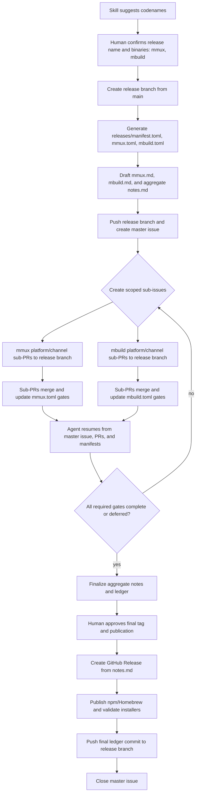

# Release Playbook

## Changelog

- 2026-05-12, @gpt55-dgx: Initial user playbook for staged Motlie binary releases, Linux cross-compilation, macOS signing, npm publication, and Homebrew tap updates.
- 2026-05-12, @gpt55-dgx: Added step-by-step npm authentication guidance and linked the repo-local release skill.
- 2026-05-12, @gpt55-dgx: Generalized the release playbook around a user-specified binary target; `mmux` is now only the worked example.
- 2026-05-12, @gpt55-dgx: Clarified that CI workflows are future automation; the current release execution path is the manual process in `docs/PLAN_RELEASES.md`.
- 2026-05-12, @gpt55-dgx: Aligned the playbook to branch-local per-binary manifests and a release coordination PR with sub-PR status updates.
- 2026-05-12, @gpt55-dgx: Added operator handoff workflow showing how the release skill prompts humans and updates manifest state at each release gate.
- 2026-05-13, @gpt55-dgx: Tightened manifest status schema, target-specific gates, evidence requirements, merge strategy, disabled-channel handling, and v0 Darwin cross-build toolchain guidance.
- 2026-05-13, @gpt55-dgx: Added manifest-tracked installer validation, detached-tag build guidance, GitHub Pages installer update rules, and release rollback semantics.
- 2026-05-13, @gpt55-dgx: Made static musl the default Linux artifact policy when feasible, with glibc-floor evidence only for gnu fallback/CUDA targets.
- 2026-05-14, @gpt55-dgx: Split evidence requirements by target category and clarified the default Linux musl build toolchain.
- 2026-05-14, @gpt55-dgx: Reworked the playbook for branch-local calver-codename release branches that support multiple binaries and never merge to `main`.
- 2026-05-14, @gpt55-dgx: Clarified codename placeholders, concurrent release branches, and installer template origin.
- 2026-05-14, @gpt55-dgx: Added release-note drafting and approval workflow for workspace and per-binary notes.
- 2026-05-14, @gpt55-dgx: Changed per-binary release manifests and notes to stable `releases/<bin>.toml` and `releases/<bin>.md` files discovered by scanning `releases/`.
- 2026-05-14, @gpt55-dgx: Added skill-guided codename, release branch bootstrap, master issue, sub-issue/sub-PR, and final issue-closure workflow.
- 2026-05-16, @vmm-cdx: Added optional VM guest-image artifact targets for native per-platform image builds, OCI payload publication, and v1.5 harness evidence coordinated through the release branch/sub-PR ledger model.

## Scope

This playbook describes how to produce and publish Motlie native binary releases. It also documents how the same release branch/sub-PR process applies to optional VM image artifact targets when a release event explicitly includes them. It is operational guidance for the release operator and complements:

- `docs/DESIGN_RELEASES.md`
- `docs/PLAN_RELEASES.md`
- `.agents/skills/release/SKILL.md`
- Issue #234: https://github.com/chungers/motlie/issues/234

The source repository remains:

```text
github.com/chungers/motlie
```

The package destinations are:

```text
GitHub Releases: github.com/chungers/motlie/releases
npm:             @motlie
Homebrew tap:    github.com/motlie/homebrew-tap
OCI registry:    selected per VM image artifact release, for example ghcr.io/chungers/motlie-guest
```

## Release Target Parameters

This playbook is generic. The release operator must identify the release event and every scoped artifact target before starting a release. Native binary targets use per-binary manifests; optional VM image artifact targets use the manifest kind documented below. `mmux` is the first worked binary example used to validate the workflow, not the only supported target.

Required release-event fields:

```text
RELEASE_NAME=<YYYY-MM-codename>
RELEASE_BRANCH=release/<release-name>
RELEASE_TAG=<release-name>
WORKSPACE_MANIFEST=releases/manifest.toml
WORKSPACE_NOTES=releases/notes.md
```

Per-binary manifests are discovered by scanning `releases/*.toml`, excluding `releases/manifest.toml`, and parsing files with `kind = "motlie.binary-release"`. Optional VM image artifact manifests use `kind = "motlie.vm-image-artifact"`. Do not place the release version in the filename; the version belongs in the manifest identity fields.

Required fields inside each per-binary manifest:

```text
BINARY_MANIFEST=releases/<bin>.toml
BINARY_NOTES=releases/<bin>.md
[identity].binary=<installed command name>
[identity].version=<release version>
[build].cargo_package=<cargo package name>
[build].cargo_bin=<cargo binary name>
[install].default_path=<default absolute install path, if any>
[install].force_command_safe=true|false
[release].notes_path=releases/<bin>.md
```

Worked `mmux` target:

```text
RELEASE_NAME=2026-05-amber-aardvark
RELEASE_BRANCH=release/2026-05-amber-aardvark
RELEASE_TAG=2026-05-amber-aardvark
WORKSPACE_MANIFEST=releases/manifest.toml
WORKSPACE_NOTES=releases/notes.md
BINARY_MANIFEST=releases/mmux.toml
BINARY_NOTES=releases/mmux.md
[identity].binary=mmux
[identity].version=0.1.0
[build].cargo_package=motlie-mmux
[build].cargo_bin=mmux
[install].default_path=/usr/local/bin/mmux
[install].force_command_safe=true
[homebrew].formula=mmux
[npm].package_prefix=@motlie/mmux
[installer].script=install-mmux.sh
```

For `FORCE_COMMAND_SAFE=true`, the direct installer must default to archive mode and the runtime path must execute the native binary directly. For `FORCE_COMMAND_SAFE=false`, npm-mode install may be acceptable for non-login use cases, but native binaries and explicit runtime paths are still required.

## Release Model

Use a release branch instead of publishing directly from a local build. The release branch starts from `main`, is named `release/<YYYY-MM-codename>`, and carries branch-local release manifests, release notes, and status updates from platform-specific sub-PRs.

For a new release, the release skill may suggest candidate codenames, check remote branch/tag conflicts, and ask the human to choose the release event name. After the release name and scoped artifact list are confirmed, the skill may create the release branch, generate initial workspace and artifact manifests, generate draft per-artifact and aggregate release notes, push the branch, and create a master tracking GitHub issue.

The master issue coordinates the release. It should summarize release identity, binaries, enabled channels, target matrix, release branch, manifest files, and the current next step. It is not the source of truth for artifact names, target status, or publication state. If the master issue and manifests disagree, the release branch manifests win.

Sub-release work is tracked with sub-issues and sub-PRs. A sub-issue describes one scoped platform/channel/gate job, such as `mmux linux artifacts` or `mbuild macOS signing`, and instructs the operator to branch from the release branch, update only the relevant manifest gates/evidence, and open a PR back to the release branch. The sub-PR should close the sub-issue when merged.

The release should move through these gates:

1. Release branch in `chungers/motlie`.
2. Workspace ledger under `releases/manifest.toml`, plus artifact manifests discovered from stable `releases/*.toml` files.
3. Master GitHub issue for release coordination.
4. Platform or channel sub-issues and sub-PRs targeting the release branch.
5. Manifest status updates recording staging evidence.
6. Cherry-pick reusable source, doc, skill, or tooling fixes back to `main` through separate PRs when needed.
7. Final source tag from the release branch.
8. Final artifact build, signing when applicable, and publication from the final tag.
9. npm package publication when npm binary channels are in scope.
10. Homebrew tap PR and bottle publication when Homebrew binary channels are in scope.
11. Final release-branch ledger commit and uploaded manifest assets recording final URLs, checksums, and package links.
12. Master issue closure after the GitHub Release is live and final ledger state is pushed.

This keeps staging, final publication, and post-release audit metadata distinct. If a later gate fails, status remains inspectable in the retained release branch without moving the release tag. Release branches never merge to `main`.

Multiple release events may run concurrently. A fix cherry-picked from one release branch to `main` can be pulled into another release branch through a normal merge from `main` when it applies there.

### Two-Binary Example Flow

Example release event: `release/2026-05-amber-aardvark` with binaries `mmux` and `mbuild`.



The outcome of each sub-PR is a manifest update on the release branch. The outcome of the release is a live GitHub Release plus a retained release branch whose manifests record final URLs, checksums, package links, validation evidence, and closed tracking issue references.

### Optional VM Image Artifact Targets

The release branch/sub-PR model also applies to Motlie VM guest image artifacts
when they are explicitly in scope for a release event. VM images are optional
artifact targets. A release may publish only native binaries, only VM
image/OCI payloads, or both. Binary-only releases do not run VM image builds or
VM image gates.

Required VM image artifact manifest fields:

```text
IMAGE_MANIFEST=releases/motlie-vmm-guest-v1.5.toml
kind="motlie.vm-image-artifact"
[identity].image="motlie-vmm-guest"
[identity].contract_version="v1.5"
[source].image="docker.io/library/ubuntu:24.04"
[source].profile="ubuntu-systemd"
[publish].image_ref="ghcr.io/chungers/motlie-guest:v1.5"
```

Typical target matrix:

```text
ch-linux-amd64      # Linux/KVM/Cloud Hypervisor on native amd64
vz-darwin-arm64     # Apple Virtualization.framework on Apple Silicon
ch-linux-arm64      # optional CH parity target when arm64 Linux is available
```

Native per-platform builders are the acceptance path. The current `mbuild`
emitter can import a compatible OCI image, build static musl Motlie guest
binaries, run rootless-`chroot` package staging, emit backend artifacts, and
export a local OCI layout. Cross-architecture rootless-`chroot` package
staging requires qemu-user/binfmt. The planned CH-native package engine is
`native-ch-bootstrap`, which boots a temporary same-architecture CH VM and runs
package/setup steps inside the guest. Because CH uses KVM, this native
bootstrap path does not emulate another CPU architecture.

qemu-user/binfmt is an allowed local cross-architecture convenience, but it is
not required for the release gate and must not replace native
`ch-linux-amd64` or `vz-darwin-arm64` evidence.

Each VM image sub-issue should name:

- release branch
- VM image manifest path
- target id and required host/backend
- `mbuild build`, `mbuild validate`, `mbuild oci export`, and harness scenario
  commands to run
- expected evidence fields to update
- sub-PR target, which is the release branch

Each VM image sub-PR updates only the manifest evidence for its target. It
does not commit rootfs tarballs, disk images, local OCI layouts, or VM images.
Evidence should include the source commit, host platform, guest platform,
source image-index digest, selected platform-manifest digest, assembled rootfs
sha256, backend artifact digests, OCI image manifest digest, and v1.5 harness
scenario result links.

Final publication follows the same release rule as binaries: the final
multi-arch OCI image index and any GitHub Release assets must trace to the
release tag or retained release branch state, and final URLs/digests are
recorded in the release branch ledger after publication.

## Operator Handoff and Skill Prompts

Release work can be performed by different humans or agents on different hosts. The branch-local workspace and per-binary manifests are the handoff documents. The release skill is responsible for reading those manifests, identifying the next gate, prompting the human for the action appropriate to that gate, and recording evidence through a branch commit or sub-PR update.

At the start of every release turn, the skill should:

1. Identify itself and check `git status --short --branch`.
2. Read `releases/manifest.toml`, then scan `releases/*.toml` for artifact manifests, excluding `releases/manifest.toml` and requiring an approved kind such as `motlie.binary-release` or `motlie.vm-image-artifact`.
3. Inspect the master issue, sub-issues, and sub-PRs when they exist.
4. Summarize the current manifest-derived release state, incomplete gates, and the branch, issue, or PR the operator should work on.
5. Ask for explicit approval before publishing, tagging, modifying package registries, changing Homebrew tap state, or closing the master issue.
6. Update only manifest status/evidence for staging work; final published URLs and checksums belong in the final release-branch ledger commit.

Operator prompts should be concrete. The prompt should tell the human what host/platform is needed, what branch to pull, what command group will run, and what manifest gate will be updated.

Gate rows are keyed by `(id, target_id)`. Use `target_id = ""` only for global gates or explicit rollups. A rollup row sets `rollup = true` and is complete only when every enabled target-specific row for that gate is `complete` or explicitly `deferred`. Platform/channel work should update target-specific rows first so concurrent operators do not collide on one coarse gate. Gate evidence entries use this shape:

```toml
evidence = [
  { kind = "command-log", ref = "PR #123 comment", sha256 = "", note = "rustc -Vv and cargo -V output recorded" },
]
```

For `staged`, `complete`, `deferred`, and `failed`, the gate or target status must record `completed_at`, `completed_by`, `source_commit`, and `evidence`. Disabled-channel gates are marked `deferred` when the release branch opens, with `deferred_reason = "channel disabled"`.

| Release gate | Operator surface | Skill prompt and action |
| --- | --- | --- |
| Intake | `main` | Suggest codenames, check remote branch/tag conflicts, then confirm `RELEASE_NAME`, `RELEASE_BRANCH`, `RELEASE_TAG`, all binaries and versions, enabled channels, and platform targets. If missing, prompt for the missing field before editing files. |
| Release branch | `release/<release-name>` | Prompt to create the release branch, add `releases/manifest.toml`, add stable `releases/<bin>.toml` manifests and their referenced notes, and push the branch. Update the `release-branch-created` gate with branch URL and source commit. |
| Master issue | GitHub issue | Prompt to create the master tracking issue after the release branch is pushed, record it in `releases/manifest.toml`, and state that manifests are authoritative if issue/PR state disagrees. |
| Sub-issues | GitHub issues | Prompt to create scoped platform/channel/gate issues. Each issue names the release branch, binary manifest, gate, target id, expected evidence, and sub-PR target. |
| Linux staging | sub-PR to release branch | Prompt the Linux operator to pull the release branch, build the scoped `target_id`, package or validate artifact names from the manifest, and update the corresponding target status plus `(id, target_id)` gate with commit, checksum, toolchain, and evidence. |
| macOS staging | sub-PR to release branch | Prompt the macOS operator to pull the release branch, build with manifest `rust_target`, run build-path and installed-path `codesign` checks, and update the Darwin signing gate with timestamp, actor, source commit, signing identity, and evidence. |
| npm staging | sub-PR to release branch | Prompt the operator to generate one native package candidate per `target_id` using manifest `npm_package`, `bin_path`, and `node_launcher = false`; run `npm pack --dry-run`; update target-specific npm gate status only. |
| Homebrew staging | tap PR or source-side template PR | Prompt the operator to prepare the tap PR shape and record tap PR evidence. Do not merge live tap changes until final source tag exists. |
| Release branch finalization | release branch plus master issue | Prompt the human reviewer to confirm all required gates are `complete` or explicitly `deferred`, cross-check master/sub-issue state, then identify any fixes that must be cherry-picked to `main`. Never merge the release branch to `main`. |
| Final tag | release branch | Prompt for explicit approval to create and push `<release-name>`. Verify the workspace manifest tag and per-binary versions before tagging. |
| GitHub Release | final tag | Prompt for explicit approval to create the GitHub Release and upload final assets. Use manifest asset names and release notes. |
| Installer validation | final GitHub Release assets | Prompt the operator to run the release-pinned installer on each target platform, execute `<bin> --version` from the installed path, and update the target-specific `installer-validated` gate. |
| npm publish | final artifacts | Prompt for explicit approval and auth mode. Publish only after final artifacts exist and package dry-runs/install tests pass. |
| Homebrew publish | `motlie/homebrew-tap` | Prompt for tap PR merge or bottle publication only after the final source tag exists and formula tests pass. |
| Final ledger | release branch | Prompt to update `state = "published"` and record final URLs, checksums, npm links, Homebrew tap commit, and install evidence. Push the ledger commit to the retained release branch and never move the release tag for ledger-only metadata. |
| Master issue closure | GitHub issue | Prompt to close the master issue only after the GitHub Release is live, final ledger state is pushed, and required package/install gates are complete or deferred. |

The skill reference `.agents/skills/release/references/operator-prompts.md` contains the step-specific prompt templates. Operators should prefer those prompts over reconstructing the process from memory.

## Release Branch

Open a release branch from `main` before building final binaries. The release branch is retained as the ledger and is never merged to `main`.

Recommended branch name:

```text
release/2026-05-amber-aardvark
```

The initial branch should include:

- Version updates in `Cargo.toml`.
- The workspace manifest, `releases/manifest.toml`.
- Workspace release notes, `releases/notes.md`.
- Per-binary manifests and notes, for example `releases/mmux.toml` and `releases/mmux.md`.
- Source-side installer, npm, or Homebrew templates under branch-local `releases/` if needed. Installer scripts should be copied from canonical templates on `main`, normally `bins/<bin>/install-template.sh`, into `releases/install/install-<bin>.sh`.

Release notes should be drafted at branch creation:

- `releases/notes.md` is the aggregate GitHub Release body and must list all binaries, binary versions, distribution channels, target platforms, install commands, user-visible changes, verification/checksum guidance, and known issues.
- Each binary manifest's `[release].notes_path`, for example `releases/mmux.md`, contains binary-specific changes, CLI/API changes, target matrix, package names, install examples, compatibility notes, and known issues.
- The release skill may draft from manifests and `git log`, but a human must provide or approve the user-visible summary. It should aggregate `releases/notes.md` from every discovered per-binary note plus release-event summary text. Do not publish notes with placeholders or claims not backed by the manifests or release owner input.

Platform-specific work should land as sub-PRs targeting the release branch:

```text
release/2026-05-amber-aardvark-mmux-linux-x64 -> release/2026-05-amber-aardvark
release/2026-05-amber-aardvark-mmux-darwin-arm64 -> release/2026-05-amber-aardvark
release/2026-05-amber-aardvark-mmux-npm -> release/2026-05-amber-aardvark
```

Each sub-PR should update the relevant per-binary manifest with status, source commit, timestamp, actor, and evidence links. Do not commit built binaries to git.

Use merge commits for sub-PRs into the release branch when possible, because preserving sub-PR merge history makes manifest evidence and platform handoffs easier to audit. Reusable fixes must be cherry-picked to normal `main` PRs; never merge the release branch back to `main`.

## Final Tag and GitHub Release

Create the release tag from the release branch after all required gates are complete or explicitly deferred.

```sh
git switch release/2026-05-amber-aardvark
git pull --ff-only
rg -n 'name = "2026-05-amber-aardvark"|tag = "2026-05-amber-aardvark"|binary = "mmux"|version = "0.1.0"' releases Cargo.toml
git tag 2026-05-amber-aardvark
git push origin 2026-05-amber-aardvark
```

Important: a GitHub Release is tag-centric, not PR-centric. The final tag must point to the exact source commit used for final artifacts. Staging builds from the release branch are useful evidence, but final artifacts must be rebuilt or revalidated from the final tag if the commit changed.

Build final artifacts from a detached checkout of the tag so the source tree cannot accidentally include release-branch or working-tree changes:

```sh
git switch --detach 2026-05-amber-aardvark
git status --short --branch
```

Create the GitHub Release from the committed, human-approved release notes:

```sh
gh release create 2026-05-amber-aardvark \
  --repo chungers/motlie \
  --title "2026-05 amber-aardvark" \
  --notes-file releases/notes.md
```

Because release tags are calver-codenames rather than semver, explicitly mark the intended stable release when needed:

```sh
gh release edit 2026-05-amber-aardvark --repo chungers/motlie --latest
```

## Cross-Compile on Linux

The final build should run from the source tag and produce target artifacts listed in the manifest:

```text
linux-x64-musl
linux-arm64-musl
darwin-x64
darwin-arm64
```

The Linux build uses static musl targets by default when feasible and uses `cargo-zigbuild` as the default v0 Darwin cross-build path. A release may document an approved exception in manifest evidence, but the normal release contract is:

- all outputs are built from the release tag;
- `Cargo.lock` is committed and unchanged at the final tag;
- target names match the discovered `releases/<bin>.toml` binary manifests;
- artifact names use explicit manifest fields such as `archive_asset`;
- archive binary paths use explicit manifest fields such as `archive_binary_path`;
- `linux-*-musl` targets record static-link evidence;
- `linux-*-gnu` fallback targets record both build-host glibc and binary GLIBC symbol floor;
- Darwin binaries produced on Linux are not considered final until macOS signing verification passes.

Universal build evidence must record `rustc -Vv` and `cargo -V`. For Darwin cross builds, also record `cargo zigbuild -V` and `zig version`.

For pure-Rust `linux-*-musl` targets, the v0 default toolchain is `rustup + cargo build --target`. Use `cargo-zigbuild` for musl only when C dependencies need a musl-aware linker. Musl evidence must record `file <binary>`, `ldd <binary>`, and `readelf -d <binary>` to show the binary has no shared runtime dependencies. If `rust-toolchain.toml` is not present for the release tag, the exact Rust toolchain identity in evidence is mandatory.

If a release enables `linux-*-gnu` targets because static musl is not feasible or because a glibc-linked runtime such as CUDA is required, evidence must also record `ldd --version` for the build host and `objdump -T <binary> | grep GLIBC_ | sort -u` for the actual binary GLIBC requirement. Populate `glibc_build_host_version` from `ldd --version` and `glibc_min_version` from the highest GLIBC symbol required by the built binary.

For `mmux` v0.1, leave `gnu_enabled = false` and make `musl_enabled = true`.

Generic archive names are a convention only. If the manifest provides an explicit `archive_asset`, use the manifest value.

```text
motlie-${BIN}-v${VERSION}-linux-x64-musl.tar.gz
motlie-${BIN}-v${VERSION}-linux-arm64-musl.tar.gz
motlie-${BIN}-v${VERSION}-darwin-x64.tar.gz
motlie-${BIN}-v${VERSION}-darwin-arm64.tar.gz
```

Worked `mmux` archive names:

```text
motlie-mmux-v0.1.0-linux-x64-musl.tar.gz
motlie-mmux-v0.1.0-linux-arm64-musl.tar.gz
motlie-mmux-v0.1.0-darwin-x64.tar.gz
motlie-mmux-v0.1.0-darwin-arm64.tar.gz
```

Every archive should include:

```text
bin/${BIN}
README.md
LICENSE
```

Generate checksums for every final archive:

```sh
shasum -a 256 "motlie-${BIN}-v${VERSION}"-*.tar.gz > SHA256SUMS
```

Do not upload unsigned Darwin artifacts as final release assets. If candidate artifacts must be shared before final signing, use PR evidence or clearly marked staging assets, and rebuild or revalidate from the final tag before publishing.

## macOS Signing Gate

Run a separate manual or manually approved gate on macOS during staging and again for final release artifacts if the final tag differs from the staged source commit.

This step exists because Apple Silicon validates Mach-O code signatures at execution time. A binary that works from one path can fail from another path after copying, so the final installed-path behavior must be verified.

Minimum signing for this release path is ad-hoc signing:

```sh
codesign --force --sign - "bin/${BIN}"
codesign --verify --strict --verbose=2 "bin/${BIN}"
"bin/${BIN}" --version
```

Manual signing workflow for final artifacts:

1. Build or download Darwin artifacts produced from the final source tag.
2. Extract each archive.
3. Re-sign `bin/${BIN}`.
4. Verify the signature.
5. Execute `bin/${BIN} --version`.
6. Repack the archive with the signed binary.
7. Recompute checksums.
8. Upload signed Darwin archives and checksum file to the GitHub Release.

Apple Silicon final-path verification:

```sh
sudo install -m 755 "bin/${BIN}" "${INSTALL_PATH}"
sudo codesign --force --sign - "${INSTALL_PATH}"
codesign --verify --strict --verbose=2 "${INSTALL_PATH}"
"${INSTALL_PATH}" --version
```

This final-path verification is required for:

- direct installer release validation;
- Darwin npm package validation;
- Homebrew formula or bottle validation.

Developer ID signing and notarization are not required for the first release path. They are a later distribution-hardening step if public download/Gatekeeper UX requires it.

## Finalize GitHub Release

After final Linux builds and final macOS signing pass from the final source tag, create or update the GitHub Release so only final artifacts are presented as installable.

Final release assets should match the manifest's explicit `archive_asset` values. For `mmux`:

```text
motlie-${BIN}-v${VERSION}-linux-x64-musl.tar.gz
motlie-${BIN}-v${VERSION}-linux-arm64-musl.tar.gz
motlie-${BIN}-v${VERSION}-darwin-x64.tar.gz
motlie-${BIN}-v${VERSION}-darwin-arm64.tar.gz
SHA256SUMS
${INSTALLER}
```

The installer script should default to archive mode for host/SSH-safe binaries:

```sh
sh "${INSTALLER}" --source archive
```

It may also support npm mode:

```sh
sh "${INSTALLER}" --source npm
```

After final assets are uploaded, validate the release-pinned installer URL on each supported target and update the corresponding `installer-validated` gate in the relevant per-binary manifest:

```sh
curl -fsSLO https://github.com/chungers/motlie/releases/download/2026-05-amber-aardvark/install-mmux.sh
sh install-mmux.sh --source archive --prefix /usr/local
/usr/local/bin/mmux --version
```

GitHub Pages installer URLs are optional convenience entrypoints. If enabled for a release, update them only after the version-pinned GitHub Release installer exists:

1. Open a PR to the configured Pages repository, for example `motlie/motlie.github.io`.
2. Update `/install/<bin>.sh` to redirect to or fetch the current release-pinned GitHub Release installer.
3. Verify the Pages URL downloads the intended release-pinned script and that checksums match.
4. Record the Pages URL, Pages commit, and verification evidence in the retained release-branch ledger.

If no Pages repository is configured, skip this channel and do not advertise the Pages URL as a production install path.

When the artifacts are final and checksums match, publish the GitHub Release as the stable release for the tag.

## npm Publication

npm packages are published after final GitHub Release artifacts exist and after macOS signing passes.

Publish native packages only. Do not publish a Node boot script as the binary runtime entrypoint.

Generic package names are a convention only. If the manifest provides explicit `npm_package` values, use the manifest values.

```text
${NPM_PREFIX}-linux-x64-musl
${NPM_PREFIX}-linux-arm64-musl
${NPM_PREFIX}-darwin-x64
${NPM_PREFIX}-darwin-arm64
```

Worked `mmux` package names:

```text
@motlie/mmux-linux-x64-musl
@motlie/mmux-linux-arm64-musl
@motlie/mmux-darwin-x64
@motlie/mmux-darwin-arm64
```

Package contents:

```text
package.json
README.md
LICENSE
bin/${BIN}
```

Each package should expose:

```json
{
  "bin": {
    "<bin>": "bin/<bin>"
  }
}
```

Publication workflow:

1. Generate package directories from the final signed/release artifacts.
2. Run `npm pack --dry-run` for each package.
3. Install each package locally or in CI.
4. Execute `${BIN} --version` from the npm-installed path.
5. Select the npm auth path.
6. Publish to the npm registry under `@motlie`.

### npm Authentication Steps

npm credentials are needed only for the publish operation. They are not needed for build, packaging, GitHub Release upload, installer verification, or Homebrew work.

No npm API key is needed for:

1. Linux cross-compilation.
2. macOS signing.
3. Archive creation.
4. Checksum generation.
5. GitHub Release asset upload.
6. npm package directory generation.
7. `npm pack --dry-run`.
8. Local package install verification from a generated `.tgz`.
9. Homebrew formula PR or bottle build.

Preferred auth path:

- Use npm trusted publishing from GitHub Actions when available.
- Configure trusted publishing for the package and the exact GitHub Actions workflow.
- Give the workflow `id-token: write`.
- Keep npm provenance enabled; trusted publishing can attach registry provenance without a long-lived npm token.
- Do not create or store `NPM_TOKEN` when trusted publishing is working.

Bootstrap fallback path:

1. Create a granular npm token scoped to the `@motlie` org/packages.
2. Store it as a GitHub Actions secret in `chungers/motlie`.
3. Name the secret `NPM_TOKEN`.
4. Use it only in the `npm publish` step.
5. Pass it as `NODE_AUTH_TOKEN`.
6. Do not write an authenticated `.npmrc` into the repository.
7. Revoke the token after trusted publishing is configured and verified.

Token name if needed:

```text
NPM_TOKEN
```

Token-backed publish step:

```yaml
- uses: actions/setup-node@v4
  with:
    node-version: 24
    registry-url: https://registry.npmjs.org

- run: npm publish --access public
  working-directory: dist/npm/@motlie/<package-name>
  env:
    NODE_AUTH_TOKEN: ${{ secrets.NPM_TOKEN }}
```

Trusted-publishing shape:

```yaml
permissions:
  contents: read
  id-token: write

steps:
  - uses: actions/setup-node@v4
    with:
      node-version: 24
      registry-url: https://registry.npmjs.org
  - run: npm publish --access public
    working-directory: dist/npm/@motlie/<package-name>
```

GitHub Actions publish jobs should run only for releases or tags, not normal PRs.

Recommended trigger:

```yaml
on:
  release:
    types: [published]
```

If future automation publishes from a release workflow, require a manual approval environment before running `npm publish`.

## Homebrew Publication

Homebrew is macOS-only in this release model and is published through:

```text
github.com/motlie/homebrew-tap
```

User install UX:

```sh
brew tap motlie/tap
brew install "${FORMULA}"
```

Homebrew publication is a separate PR to `motlie/homebrew-tap`.

The tap PR should update:

```text
Formula/<formula>.rb
```

Recommended formula source:

```ruby
url "https://github.com/chungers/motlie/archive/refs/tags/2026-05-amber-aardvark.tar.gz"
sha256 "<source-tarball-sha256>"
```

The formula should build from source and re-sign after install on macOS:

```ruby
def install
  system "cargo", "build", "--release", "--locked", "-p", "<cargo-package>"
  bin.install "target/release/<bin>"
  system "codesign", "--force", "--sign", "-", bin/"<bin>" if OS.mac?
end
```

The formula test must execute the installed binary:

```ruby
test do
  assert_match "<bin>", shell_output("#{bin}/<bin> --version")
end
```

Worked `mmux` formula values:

```text
manifest = "releases/mmux.toml"
[homebrew].formula = "mmux"
[build].cargo_package = "motlie-mmux"
[identity].binary = "mmux"
```

Bottle workflow:

1. Open tap PR.
2. Run tap CI on macOS Apple Silicon and Intel.
3. Build bottles from the formula.
4. Run the formula test from the bottled install path.
5. Publish bottle metadata using the tap workflow.
6. Merge the tap PR after bottle verification.

The Homebrew tap may use the source tarball rather than the prebuilt GitHub Release archives. The bottle workflow is responsible for producing and publishing Homebrew-managed macOS bottles.

## Future GitHub Actions Structure

The manual v0 release process does not create these workflows. Use this section only when the release process is ready to be automated after the manual process has been validated.

Future automation should use multiple workflows or multiple jobs with explicit gates.

Recommended structure:

```text
.github/workflows/release-build.yml
.github/workflows/release-npm.yml
.github/workflows/release-installer.yml
```

Release build workflow:

- Trigger on the final source tag or stable release publication.
- Build Linux and Darwin target archives from Linux.
- Upload final artifacts/checksums to the GitHub Release.

macOS signing workflow:

- Trigger manually with `workflow_dispatch`, or through a protected environment.
- Download final Darwin artifacts built from the source tag.
- Sign, verify, repack, and replace Darwin assets.
- Verify `${INSTALL_PATH} --version` from a final copied path.

npm publication workflow:

- Trigger on stable GitHub Release publication.
- Download final release artifacts.
- Generate npm packages.
- Dry-run package contents.
- Publish to `@motlie`.

Homebrew workflow:

- Runs in `motlie/homebrew-tap`, not in `chungers/motlie`.
- Triggered by a PR, `workflow_dispatch`, or repository dispatch from the source release workflow.
- Builds formula and bottles on macOS runners.

## Manual Release Checklist

- [ ] Release event captured: `RELEASE_NAME`, `RELEASE_BRANCH`, `RELEASE_TAG`, enabled channels, artifact kinds, and targets.
- [ ] Skill suggested codenames, checked remote branch/tag conflicts, and human confirmed the release name and scoped artifact list.
- [ ] Release branch created from `main`.
- [ ] `releases/manifest.toml` committed with release-event identity, branch, tag, discovery policy, global defaults, tracking issue policy, workspace gates, and final artifact completion ledger.
- [ ] One stable `releases/<bin>.toml` committed per native binary with release intent, version, explicit names, target matrix, structured target status, and `(id, target_id)` gates.
- [ ] Optional VM image artifact manifests, such as `releases/motlie-vmm-guest-v1.5.toml`, committed only when VM image artifacts are in scope.
- [ ] `releases/notes.md` and each artifact manifest's `[release].notes_path`, for example `releases/<bin>.md`, committed as release-note sources when release notes are required.
- [ ] Master tracking issue created and linked from `releases/manifest.toml`.
- [ ] Scoped sub-issues created for required platform/channel/gate work.
- [ ] Release notes list every scoped artifact, version or contract version, target family, distribution channel, install or consumption command, user-visible change, compatibility note, and known issue.
- [ ] Release owner has approved the final notes before `gh release create`.
- [ ] Disabled-channel gates are absent or marked `deferred` with `deferred_reason = "channel disabled"`.
- [ ] No PR is opened to merge the release branch to `main`.
- [ ] Platform/channel sub-PRs merged into the release branch and close matching sub-issues.
- [ ] Manifest status updated with target id, channel, staging evidence, toolchain evidence, and source commits.
- [ ] `linux-*-musl` target evidence records `file <binary>`, `ldd <binary>`, and `readelf -d <binary>` static-link evidence.
- [ ] Any enabled `linux-*-gnu` fallback target evidence records `glibc_build_host_version`, `glibc_min_version`, `ldd --version`, and `objdump -T` GLIBC symbols.
- [ ] `Cargo.lock` committed and unchanged at the final source tag.
- [ ] Reusable fixes cherry-picked to `main` PRs when needed; release branch is not merged to `main`.
- [ ] Final source tag pushed from the release branch.
- [ ] Final Linux and Darwin artifacts built from the source tag.
- [ ] Final Darwin artifacts signed and verified on macOS.
- [ ] Final checksums uploaded.
- [ ] Installer script uploaded.
- [ ] Direct installer verified from release-pinned URL and `installer-validated` gates updated.
- [ ] npm packages generated from final artifacts.
- [ ] `npm pack --dry-run` reviewed for each package.
- [ ] npm packages published to `@motlie`.
- [ ] npm installs verified for Linux and macOS packages.
- [ ] Homebrew tap PR opened against `motlie/homebrew-tap`.
- [ ] Homebrew formula builds from source tag.
- [ ] Homebrew formula re-signs installed binary on macOS.
- [ ] Homebrew bottle tests pass from installed path.
- [ ] Homebrew tap PR merged.
- [ ] GitHub Release published as stable.
- [ ] Final release-branch ledger commit updates `releases/manifest.toml` and artifact manifests with final URLs, checksums, package links, registry digests, Homebrew tap commit when applicable, and install or validation evidence.
- [ ] Master tracking issue closed after GitHub Release or registry publication is live, required package/install/image-validation gates are complete or deferred, and final ledger commit is pushed.

## Rollback

If GitHub Release artifact validation fails:

- Leave the GitHub Release unpublished or replace invalid assets before announcing the release.
- Replace failed assets with explicit operator action, for example delete/re-upload the asset or use `gh release upload --clobber` while the release is still unannounced.
- Regenerate checksums and re-upload checksum assets with the same replacement discipline.
- Re-run signing and install verification.
- If an announced asset is broken, prefer a new patch release instead of silently replacing an asset users may already have cached.

If npm publication fails before all packages are published:

- Stop publication.
- Do not publish a convenience/meta package.
- Fix and publish the missing native packages at the same version if npm permits.
- If a broken package version is already public, prefer `npm deprecate <package>@<version> "<reason>"` and publish a new patch version.
- Use `npm unpublish` only when npm policy allows it and the release owner explicitly approves; newly created packages have a 72-hour unpublish window only when policy criteria allow, unpublished package versions cannot be reused, and unpublish should not be the normal rollback plan. See npm's unpublish policy: https://docs.npmjs.com/policies/unpublish

If Homebrew publication fails:

- Leave the tap PR open.
- Fix the formula or bottle workflow in the tap PR.
- Do not change the source GitHub Release unless the source artifact is invalid.

## Open Decisions

- Whether Darwin candidate artifacts should be shared as PR evidence, workflow artifacts, or clearly marked non-final staging assets before final signing.
- Whether npm publication should run from the source repo workflow or a separate release environment.
- Whether the Homebrew tap should be updated by a bot PR from `chungers/motlie` or manually after the source release is finalized.
- Whether future public macOS downloads require Developer ID signing and notarization beyond ad-hoc signing.
