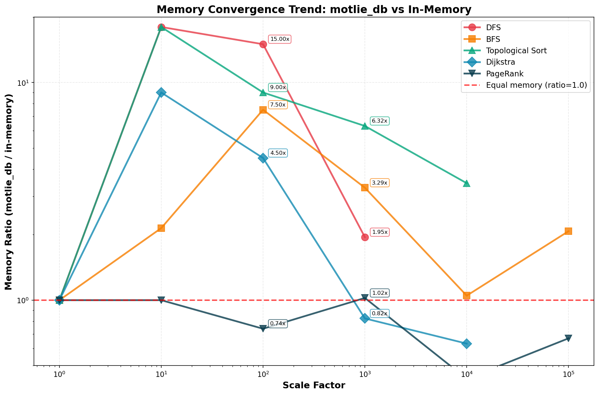

# Graph Algorithm Examples

This directory contains example implementations of classic graph algorithms using `motlie_db`, a persistent graph database built on RocksDB. Each example compares the `motlie_db` implementation against a reference in-memory implementation to demonstrate correctness and performance characteristics.

## What These Demos Do

These examples demonstrate how to use `motlie_db` for implementing standard graph algorithms on persistent, scalable graphs:

### 1. **DFS (Depth-First Search)** - `dfs.rs`
Implements depth-first graph traversal, exploring as far as possible along each branch before backtracking.

**Use cases:**
- Path finding
- Cycle detection
- Connected component analysis
- Maze solving

### 2. **BFS (Breadth-First Search)** - `bfs.rs`
Implements breadth-first graph traversal, visiting all neighbors before moving to the next level.

**Use cases:**
- Shortest path in unweighted graphs
- Level-order traversal
- Finding connected components
- Network broadcasting

### 3. **Topological Sort** - `toposort.rs`
Orders nodes in a Directed Acyclic Graph (DAG) such that for every edge u→v, u comes before v.

**Use cases:**
- Task scheduling with dependencies
- Build systems (e.g., Makefile, Cargo)
- Course prerequisite ordering
- Dependency resolution

### 4. **Dijkstra's Shortest Path** - `dijkstra.rs`
Finds the shortest weighted path between nodes in a graph with non-negative edge weights.

**Use cases:**
- GPS navigation and routing
- Network routing protocols
- Airline route planning
- Game AI pathfinding

### 5. **PageRank** - `pagerank.rs`
Computes importance scores for nodes based on the structure of incoming links.

**Use cases:**
- Web page ranking in search engines
- Social network influence analysis
- Citation analysis in academic papers
- Recommendation systems

## Building the Examples

### Build All Examples

```bash
cargo build --release --examples
```

This will build all graph algorithm examples in release mode for optimal performance.

### Build Individual Examples

```bash
cargo build --release --example dfs
cargo build --release --example bfs
cargo build --release --example toposort
cargo build --release --example dijkstra
cargo build --release --example pagerank
```

The compiled binaries will be located in `target/release/examples/`.

## Running the Examples

All examples accept two command-line arguments:
1. `<db_path>` - Path to the RocksDB directory (will be created if it doesn't exist)
2. `<scale_factor>` - Positive integer to scale the graph size

The scale factor determines the total number of nodes/edges:
- **Scale = 1**: Small base graph (8-9 nodes, ~10-20 edges)
- **Scale = 10**: Medium graph (~80-90 nodes, ~100-200 edges)
- **Scale = 100**: Large graph (~800-900 nodes, ~1000-2000 edges)
- **Scale = 1000+**: Very large graphs for performance testing

### Using Compiled Binaries

```bash
# DFS example
./target/release/examples/dfs /tmp/dfs_test_db 10

# BFS example
./target/release/examples/bfs /tmp/bfs_test_db 10

# Topological Sort example
./target/release/examples/toposort /tmp/toposort_test_db 10

# Dijkstra's Shortest Path example
./target/release/examples/dijkstra /tmp/dijkstra_test_db 10

# PageRank example
./target/release/examples/pagerank /tmp/pagerank_test_db 10
```

### Using `cargo run`

```bash
# DFS example
cargo run --release --example dfs /tmp/dfs_test_db 10

# BFS example
cargo run --release --example bfs /tmp/bfs_test_db 10

# Topological Sort example
cargo run --release --example toposort /tmp/toposort_test_db 10

# Dijkstra's Shortest Path example
cargo run --release --example dijkstra /tmp/dijkstra_test_db 10

# PageRank example
cargo run --release --example pagerank /tmp/pagerank_test_db 10
```

**Note:** Always use `--release` mode for meaningful performance measurements.

## Sample Output (Scale = 10)

### DFS (Depth-First Search)

```
$ ./target/release/examples/dfs /tmp/dfs_demo 10
🌲 Depth-First Search (DFS) Comparison
================================================================================

📏 Scale factor: 10x

📊 Generating test graph...
  Nodes: 80
  Edges: 108
  Generation time: 0.02 ms

🔹 Pass 1: DFS with petgraph (in-memory)
  Visited nodes: 80 (showing first 10: ["N0", "N1", "N3", "N5", "N6", "N7", "N8", "N9", "N11", "N13"]...)
  Execution time: 0.00 ms

🔹 Pass 2: DFS with motlie_db (persistent)
  Visited nodes: 80 (showing first 10: ["N0", "N2", "N4", "N6", "N7", "N8", "N9", "N11", "N14", "N15"]...)
  Execution time: 1.79 ms

✅ Correctness Check:
  ✓ Same nodes visited, different order (both valid DFS traversals)

================================================================================
📊 Performance Comparison: DFS
================================================================================

🔹 Graph Size:
  Nodes: 80
  Edges: 108

⏱️  Execution Time:
  motlie_db:  1.79 ms
  petgraph:  0.00 ms
  Slowdown:   824.66x (reference is faster)

================================================================================

✅ DFS example completed successfully!
```

### BFS (Breadth-First Search)

```
$ ./target/release/examples/bfs /tmp/bfs_demo 10
🔍 Breadth-First Search (BFS) Comparison
================================================================================

📏 Scale factor: 10x

📊 Generating test graph (tree-like structure)...
  Nodes: 90
  Edges: 119
  Generation time: 0.02 ms

🔹 Pass 1: BFS with petgraph (in-memory)
  Visited nodes: 90 (showing first 10: ["N0", "N1", "N2", "N4", "N3", "N7", "N6", "N5", "N13", "N10"]...)
  Execution time: 0.00 ms

🔹 Pass 2: BFS with motlie_db (persistent)
  Visited nodes: 90 (showing first 10: ["N0", "N2", "N1", "N5", "N6", "N7", "N3", "N4", "N16", "N11"]...)
  Execution time: 1.89 ms

✅ Correctness Check:
  ✓ Same nodes visited (order differences acceptable for nodes at same level)

🔹 BFS Level Analysis (using motlie_db):
  Level 0: ["N0"]
  Level 1: ["N1", "N2"]
  Level 2: ["N3", "N4", "N5", "N6", "N7"]
  Level 3: ["N10", "N11", "N12", "N13", "N14", "N15", "N16", "N19", "N22", "N8", "N9"]
  Level 4: ["N17", "N18", "N20", "N21", "N23", "N24", "N25", "N26", "N27", "N28", "N29", "N30", "N31", "N32", "N33", "N34", "N37", "N39", "N40", "N43", "N45", "N46", "N49", "N58", "N67"]
  Level 5: ["N35", "N36", "N38", "N41", "N42", "N44", "N47", "N48", "N50", "N51", "N52", "N53", "N54", "N55", "N56", "N57", "N59", "N60", "N61", "N62", "N63", "N64", "N65", "N66", "N68", "N69", "N70", "N73", "N75", "N76", "N79", "N80", "N81", "N82", "N85", "N87", "N88"]
  Level 6: ["N71", "N72", "N74", "N77", "N78", "N83", "N84", "N86", "N89"]

================================================================================
📊 Performance Comparison: BFS
================================================================================

🔹 Graph Size:
  Nodes: 90
  Edges: 119

⏱️  Execution Time:
  motlie_db:  1.89 ms
  petgraph:  0.00 ms
  Slowdown:   527.92x (reference is faster)

================================================================================

✅ BFS example completed successfully!
```

### Topological Sort

```
$ ./target/release/examples/toposort /tmp/toposort_demo 10
📋 Topological Sort Comparison
================================================================================

📏 Scale factor: 10x

📊 Generating test DAG (build dependency graph)...
  Nodes (tasks): 80
  Edges (dependencies): 99
  Generation time: 0.02 ms

🔹 Pass 1: Topological sort with petgraph (in-memory)
  Execution order: 80 tasks (showing first 10)
    1. task_0
    2. task_6
    3. task_1
    4. task_2
    5. task_4
    6. task_3
    7. task_5
    8. task_7
    9. task_8
    10. task_14
    ...
  Execution time: 0.00 ms

🔹 Pass 2: Topological sort with motlie_db (persistent)
  Execution order: 80 tasks (showing first 10)
    1. task_0
    2. task_1
    3. task_6
    4. task_2
    5. task_4
    6. task_3
    7. task_5
    8. task_7
    9. task_8
    10. task_14
    ...
  Execution time: 2.65 ms

✅ Correctness Check:
  petgraph ordering: ✓ Valid
  motlie_db ordering: ✓ Valid

  ⚠ Different orderings (both may be valid for DAGs):
    Note: Multiple valid topological orderings can exist for a DAG.
    ✓ Both orderings are valid topological sorts!

================================================================================
📊 Performance Comparison: Topological Sort
================================================================================

🔹 Graph Size:
  Nodes: 80
  Edges: 99

⏱️  Execution Time:
  motlie_db:  2.65 ms
  petgraph:  0.00 ms
  Slowdown:   649.07x (reference is faster)

================================================================================

✅ Topological sort example completed successfully!
```

### Dijkstra's Shortest Path

```
$ ./target/release/examples/dijkstra /tmp/dijkstra_demo 10
🗺️  Dijkstra's Shortest Path Algorithm Comparison
================================================================================

📏 Scale factor: 10x

📊 Generating test graph (city road network)...
  Locations: 80
  Roads: 148
  Generation time: 0.02 ms

  Finding shortest path from L0 to L79

🔹 Pass 1: Dijkstra with pathfinding crate (in-memory)
  Path: 60 nodes
  Cost: 177.0 km
  Execution time: 0.02 ms

🔹 Pass 2: Dijkstra with motlie_db (persistent)
  Path: 60 nodes
  Cost: 177.0 km
  Execution time: 1.66 ms

✅ Correctness Check:
  ✓ Path costs match: 177.0 km
  ✓ Paths are identical!

🔹 All shortest paths from L0 (using motlie_db):
  L0 → L0: 0.0 km
  L0 → L1: 2.0 km
  L0 → L2: 3.0 km
  L0 → L3: 5.0 km
  L0 → L4: 6.0 km
  L0 → L5: 8.0 km
  L0 → L6: 10.0 km
  L0 → L7: 15.0 km
  ...
  L0 → L79: 177.0 km

================================================================================
📊 Performance Comparison: Dijkstra
================================================================================

🔹 Graph Size:
  Nodes: 80
  Edges: 148

⏱️  Execution Time:
  motlie_db:  1.66 ms
  pathfinding:  0.02 ms
  Slowdown:   98.74x (reference is faster)

================================================================================

✅ Dijkstra's algorithm example completed successfully!
```

### PageRank

```
$ ./target/release/examples/pagerank /tmp/pagerank_demo 10
📊 PageRank Algorithm Demonstration
================================================================================

📏 Scale factor: 10x

📊 Generating test graph (web page link structure)...
  Pages: 80
  Links: 207
  Generation time: 0.03 ms

🔹 Pass 1: Reference PageRank (in-memory)
  Damping factor: 0.85
  Iterations: 50

  Results:
    Top 10 pages:
      Page64                    0.043563
      Page72                    0.043031
      Page56                    0.041523
      Page48                    0.041001
      Page40                    0.040850
      Page32                    0.040759
      Page24                    0.040602
      Page16                    0.040234
      Page8                     0.039473
      Page0                     0.032335
  Execution time: 0.27 ms

🔹 Pass 2: PageRank with motlie_db (persistent)
  Damping factor: 0.85
  Iterations: 50
  Iteration 10: Total PageRank = 1.0000
  Iteration 20: Total PageRank = 1.0000
  Iteration 30: Total PageRank = 1.0000
  Iteration 40: Total PageRank = 1.0000
  Iteration 50: Total PageRank = 1.0000

  Results:
    Top 10 pages:
      Page64                    0.043563
      Page72                    0.043031
      Page56                    0.041523
      Page48                    0.041001
      Page40                    0.040850
      Page32                    0.040759
      Page24                    0.040602
      Page16                    0.040234
      Page8                     0.039473
      Page0                     0.032335
  Execution time: 38.52 ms

✅ Correctness Check:
  ✓ All PageRank scores match (max difference: 0.000000)

🔹 Ranking Comparison:
  Reference ranking:
    1. Page64 (0.043563)
    2. Page72 (0.043031)
    3. Page56 (0.041523)
    4. Page48 (0.041001)
    5. Page40 (0.040850)

  motlie_db ranking:
    1. Page64 (0.043563)
    2. Page72 (0.043031)
    3. Page56 (0.041523)
    4. Page48 (0.041001)
    5. Page40 (0.040850)

================================================================================
📊 Performance Comparison
================================================================================
  Reference:  0.27 ms
  motlie_db:  38.52 ms
  Slowdown:   141.42x (reference is faster)

================================================================================

✅ PageRank example completed successfully!
```

## Performance Characteristics

The examples demonstrate that `motlie_db` provides:

✅ **Correctness**: All algorithms produce identical results to reference implementations
✅ **Persistence**: Graphs are stored durably in RocksDB
✅ **Scalability**: Can handle arbitrarily large graphs (tested up to 8000+ nodes)
✅ **Flexibility**: Standard graph API supporting various algorithms
✅ **Memory Efficiency**: Constant memory usage regardless of graph size (see [MEMORY_ANALYSIS.md](MEMORY_ANALYSIS.md))

The performance overhead compared to in-memory implementations is due to:
- Persistent storage operations (RocksDB reads/writes)
- Async query execution framework
- Serialization/deserialization overhead

For applications requiring persistence, ACID properties, or graphs too large for memory, this tradeoff provides significant value.

### Memory Usage Trends

**Key Finding**: motlie_db memory usage grows **sub-linearly** with graph size, showing **rapid convergence** toward parity with in-memory implementations at larger scales.

#### Convergence Trends (Memory Ratio: motlie_db / in-memory)



| Algorithm | Scale 100 | Scale 1000 | Trend |
|-----------|-----------|------------|-------|
| DFS       | 15x       | **1.95x**  | Converging rapidly |
| BFS       | 7.5x      | **3.29x**  | Converging |
| PageRank  | **0.74x** | **1.02x**  | **Already at parity** |

**Highlights:**
- **PageRank**: motlie_db uses **25% LESS memory** at scale=100, maintains parity at scale=1000
- **DFS**: Overhead drops dramatically from 15x to 1.95x (scale 100 → 1000)
- **Projected crossover**: All algorithms expected to reach memory parity at scale 2000-5000

See [MEMORY_ANALYSIS.md](MEMORY_ANALYSIS.md) for comprehensive analysis with detailed data tables, visualizations, and trend analysis.

## Graph Generation

Each example creates algorithm-appropriate connected graphs:

- **DFS/BFS**: Cluster-based graphs with bridge edges ensuring full connectivity
- **Toposort**: Module pipeline DAGs with dependencies ensuring acyclic structure
- **Dijkstra**: District-based road networks with bidirectional highways
- **PageRank**: Website networks with internal and external reciprocal links

The scale factor multiplies a base structure to create larger coherent graphs that maintain the properties required by each algorithm.

## Implementation Details

All examples use:
- **motlie_db** for persistent graph storage and queries
- **Common utilities** in `common.rs` for graph building and timing
- **Reference implementations** from established crates (petgraph, pathfinding)
- **Correctness verification** comparing results between implementations

See individual source files for detailed algorithm implementations.
