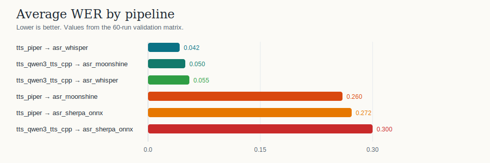
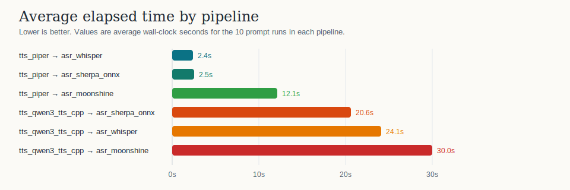

# `libs/models/examples`

This directory contains the runnable example binaries for curated model bundles.

Current example groups:

- TTS
  - [`tts_piper`](./tts_piper/README.md)
  - [`tts_qwen3_tts_cpp`](./tts_qwen3_tts_cpp/README.md)
- ASR
  - [`asr_whisper`](./asr_whisper/README.md)
  - [`asr_sherpa_onnx`](./asr_sherpa_onnx/README.md)
  - [`asr_moonshine`](./asr_moonshine/README.md)
- Embeddings
  - [`embeddings`](./embeddings/README.md)
- Chat
  - [`chat_mistral_qwen3`](./chat_mistral_qwen3/README.md)
  - [`chat_tool_binding`](./chat_tool_binding/README.md)
  - [`chat_multimodal_gemma4`](./chat_multimodal_gemma4/README.md)
  - [`chat_gguf_gwen3_gemma4`](./chat_gguf_gwen3_gemma4/README.md)
  - [`chat_multimodal_qwen3_6_27b`](./chat_multimodal_qwen3_6_27b/README.md)

## Chat and Tool-Use Capability Ledger

| Example | Backend | Curated model(s) | Advertised capabilities | Tool-use demo status |
|---------|---------|------------------|-------------------------|----------------------|
| `chat_tool_binding` | none | API-only | typed Rust tool binding | Runs without loading an LLM; builds a static `ToolList` with `get_weather` and `evaluate_math_expression`. |
| `chat_mistral_qwen3` | `mistral.rs` | Qwen3 4B safetensors | `Chat` + `Completion` + `ToolUse` | `--tool-demo` / `--tool-demo-only` run a multi-round tool loop: weather for Seattle, Portland, and San Francisco, then math-expression average. |
| `chat_multimodal_gemma4` | `mistral.rs` | Gemma 4 E2B-it safetensors | `Chat` + `Vision` + `ToolUse` | Same weather-plus-math tool loop; image+text chat remains a separate `--image=...` path. |
| `chat_gguf_gwen3_gemma4` | `llama.cpp` | Qwen3 4B GGUF, Gemma 4 E2B-it GGUF | `Chat` + `Completion` + `ToolUse` | Same weather-plus-math tool loop through llama.cpp's OpenAI-compatible chat-template path. |
| `chat_gguf_gwen3_gemma4` | `llama.cpp` | Gemma 4 E4B-it GGUF | `Chat` + `Completion` + `ToolUse` | Same weather-plus-math tool loop passed locally with the E4B Q8_0 GGUF artifact, Gemma recommended sampling params, and `thinking=Auto`. |
| catalog only | `mistral.rs` | Gemma 4 E4B-it safetensors | `Chat` + `Vision` initially | Curated bundle is registered behind `model-gemma4-e4b` with Q8 default quantization and Gemma recommended sampling params. Tool calling is model-card capable but not advertised until backend smoke coverage is added. |
| `chat_multimodal_qwen3_6_27b` | `llama.cpp` | Qwen3.6 27B GGUF | `Chat` + `Completion` | Text chat/completion only. `Vision` and `ToolUse` are not advertised for this bundle yet. |

The shared tool demo support lives in [`tool_demo_support.rs`](./tool_demo_support.rs).
It intentionally keeps tool execution caller-owned: model backends request
`ToolCall`s, and the example layer executes the Rust functions through
static `ToolList` tuple dispatch. The math tool uses `cel-cxx`, a Rust binding to the mature
Common Expression Language implementation, so the example demonstrates binding
a real Rust function instead of a hand-rolled parser.

These examples demonstrate the type-level local Rust tool path. The data-level
MCP path is intentionally scaffolding-only in this PR; concrete MCP transports
and JSON-RPC lifecycle support are tracked by GitHub issue `#284` and should
land in a future PR.

Use `--tool-demo "What is Rust?"` on the model-backed chat examples to run the
ordinary chat path first and then the weather-plus-math tool loop. Use
`--tool-demo-only` to isolate just the tool loop.

## Demo Output Ledger

These excerpts were captured from this branch after the `cel-cxx` integration.
Backend-native loader logs and timing noise are omitted.

| Example | Scenario | Command | Captured output |
|---------|----------|---------|-----------------|
| `chat_tool_binding` | API-only typed binding without an LLM | `cargo run -p motlie-models --example chat_tool_binding --no-default-features` | Registers two tools, simulates three weather calls, then executes `evaluate_math_expression` with `{"expression":"(72.0 + 68.0 + 64.0) / 3.0"}` and returns `{"value":68.0,"formatted":"68","engine":"cel-cxx"}`. |
| `chat_gguf_gwen3_gemma4` | Qwen3 4B GGUF live LLM tool loop through `llama.cpp` | `cargo run -p motlie-models --no-default-features --features model-qwen3-4b-gguf --example chat_gguf_gwen3_gemma4 -- --tool-demo-only "What is Rust?"` | Advertises `ToolUse`, calls `get_weather` for Seattle, Portland, and San Francisco, then calls `evaluate_math_expression` with `{"expression":"(72.0 + 68.0 + 64.0) / 3.0"}`. The tool returns `{"value":68.0,"formatted":"68","engine":"cel-cxx"}`, and the final model response is `The average current Fahrenheit temperature for Seattle, Portland, and San Francisco is 68 degrees.` |
| `chat_gguf_gwen3_gemma4` | Gemma 4 E4B-it GGUF live LLM tool loop through `llama.cpp` | `./target/release/examples/chat_gguf_gwen3_gemma4 --chat=google/gemma4_e4b_gguf --tool-demo-only "What is Rust? Then calculate the average temperature for Seattle, Portland, and San Francisco."` | From a cold curated download and release build, loads `GGUF Q8_0` with `temperature=1.0`, `top_p=0.95`, and `thinking=Auto`; calls `get_weather` for Seattle, Portland, and San Francisco, then calls `evaluate_math_expression` with `{"expression":"(72.0 + 68.0 + 64.0) / 3.0"}`. The tool returns `{"value":68.0,"formatted":"68","engine":"cel-cxx"}`, and the final model response is `The average current Fahrenheit temperature for Seattle, Portland, and San Francisco is 68.0°F.` |
| `chat_mistral_qwen3` | Qwen3 4B safetensors live LLM tool loop through `mistral.rs` | `cargo run -p motlie-models --no-default-features --features model-qwen3-4b --example chat_mistral_qwen3 -- --tool-demo-only "What is Rust?"` | Uses the same shared `tool_demo_support::run_tool_demo_with_options` path and emits the same `tool-round`, `tool-call-*`, `tool-result`, and `tool-final-response` fields when the safetensors bundle is available. |
| `chat_multimodal_gemma4` | Gemma 4 E2B-it safetensors live LLM tool loop through `mistral.rs` | `cargo run -p motlie-models --no-default-features --features model-gemma4-e2b --example chat_multimodal_gemma4 -- --tool-demo-only "What is Rust?"` | Uses the same shared `tool_demo_support::run_tool_demo_with_options` path as the Qwen3 examples; image+text chat remains separate from this text-only tool loop. |

Representative API-only output:

```text
registered-tools: 2
tool: get_weather
tool: evaluate_math_expression
assistant-call-name: get_weather
assistant-call-args: {"city":"Seattle","units":"fahrenheit"}
tool-content: {"city":"Seattle","temperature":72.0,"units":"fahrenheit","summary":"clear"}
assistant-call-name: get_weather
assistant-call-args: {"city":"Portland","units":"fahrenheit"}
tool-content: {"city":"Portland","temperature":68.0,"units":"fahrenheit","summary":"clear"}
assistant-call-name: get_weather
assistant-call-args: {"city":"San Francisco","units":"fahrenheit"}
tool-content: {"city":"San Francisco","temperature":64.0,"units":"fahrenheit","summary":"clear"}
assistant-call-name: evaluate_math_expression
assistant-call-args: {"expression":"(72.0 + 68.0 + 64.0) / 3.0"}
tool-content: {"expression":"(72.0 + 68.0 + 64.0) / 3.0","value":68.0,"formatted":"68","engine":"cel-cxx"}
```

Representative Qwen3 GGUF output:

```text
capabilities:
  - kind=ToolUse input=[Text, StructuredJson] output=[Text, StructuredJson] interaction=MultiTurn summary=Tool definitions, assistant tool calls, and tool-result turns on the chat surface.
--- tool calling ---
tool-round: 1
tool-call-name: get_weather
tool-call-args: {"city": "Seattle", "units": "fahrenheit"}
tool-result: {"city":"Seattle","temperature":72.0,"units":"fahrenheit","summary":"clear"}
tool-round: 2
tool-call-name: get_weather
tool-call-args: {"city": "Portland", "units": "fahrenheit"}
tool-result: {"city":"Portland","temperature":68.0,"units":"fahrenheit","summary":"clear"}
tool-round: 3
tool-call-name: get_weather
tool-call-args: {"city": "San Francisco", "units": "fahrenheit"}
tool-result: {"city":"San Francisco","temperature":64.0,"units":"fahrenheit","summary":"clear"}
tool-round: 4
tool-call-name: evaluate_math_expression
tool-call-args: {"expression": "(72.0 + 68.0 + 64.0) / 3.0"}
tool-result: {"expression":"(72.0 + 68.0 + 64.0) / 3.0","value":68.0,"formatted":"68","engine":"cel-cxx"}
tool-final-response: The average current Fahrenheit temperature for Seattle, Portland, and San Francisco is 68 degrees.
```

Representative Gemma 4 E4B GGUF output:

```text
quantization: GGUF Q8_0
recommended-generation-params: GenerationParams { max_tokens: None, temperature: Some(1.0), top_p: Some(0.95), stop_sequences: [] }
thinking: Auto
capabilities:
  - kind=ToolUse input=[Text, StructuredJson] output=[Text, StructuredJson] interaction=MultiTurn summary=Tool definitions, assistant tool calls, and tool-result turns on the chat surface.
--- tool calling ---
tool-demo-effective-params: GenerationParams { max_tokens: Some(192), temperature: Some(1.0), top_p: Some(0.95), stop_sequences: [] }
tool-round: 1
tool-call-name: get_weather
tool-call-args: {"city":"Seattle","units":"fahrenheit"}
tool-result: {"city":"Seattle","temperature":72.0,"units":"fahrenheit","summary":"clear"}
tool-round: 2
tool-call-name: get_weather
tool-call-args: {"city":"Portland","units":"fahrenheit"}
tool-result: {"city":"Portland","temperature":68.0,"units":"fahrenheit","summary":"clear"}
tool-round: 3
tool-call-name: get_weather
tool-call-args: {"city":"San Francisco","units":"fahrenheit"}
tool-result: {"city":"San Francisco","temperature":64.0,"units":"fahrenheit","summary":"clear"}
tool-round: 4
tool-call-name: evaluate_math_expression
tool-call-args: {"expression":"(72.0 + 68.0 + 64.0) / 3.0"}
tool-result: {"expression":"(72.0 + 68.0 + 64.0) / 3.0","value":68.0,"formatted":"68","engine":"cel-cxx"}
tool-final-response: The average current Fahrenheit temperature for Seattle, Portland, and San Francisco is 68.0°F.
```

The detailed 2x3 TTS-to-ASR validation matrix lives in
[`../docs/VALIDATION_TTS_ASR_PIPELINES.md`](../docs/VALIDATION_TTS_ASR_PIPELINES.md).

Regression-smoke note:

- `./scripts/check_curated_model_examples.sh --mode smoke-qwen3-whisper` is the
  dedicated co-link smoke for issue `#211`.
- It specifically exercises `tts_qwen3_tts_cpp | asr_whisper` with both
  backends built into the same feature set, so Linux `ggml` symbol
  interposition regressions around `-Wl,-Bsymbolic` fail early.

Quiet-mode note:

- `--quiet` suppresses whole-process stderr for the active example, including
  backend-native logs and panic diagnostics. Use it only when stdout must stay
  completely machine-readable.

Suggested artifact env vars for the commands below:

```bash
export PIPER_ARTIFACT_ROOT="$HOME/.cache/huggingface/hub"
export QWEN3_TTS_CPP_ARTIFACT_ROOT="/tmp/qwen3-tts-models"
export WHISPER_ARTIFACT_ROOT="$HOME/.cache/huggingface/hub"
export SHERPA_ARTIFACT_ROOT="$HOME/.cache/huggingface/hub"
export MOONSHINE_ARTIFACT_ROOT="$HOME/.cache/huggingface/hub"
```

Dedicated qwen3-tts.cpp / Whisper smoke:

```bash
./scripts/check_curated_model_examples.sh --mode smoke-qwen3-whisper
```

## Release Builds

### CPU release build used for the published stats

The WER and latency numbers in the validation report and the charts below were
measured from this CPU-oriented release build on this host:

```bash
export ORT_LIB_PATH=/tmp/onnxruntime-cuda/build/Linux-sm121/Release
export LD_LIBRARY_PATH=/tmp/onnxruntime-cuda/build/Linux-sm121/Release${LD_LIBRARY_PATH:+:$LD_LIBRARY_PATH}
export PIPER_ESPEAKNG_DATA_DIRECTORY=/usr/lib/aarch64-linux-gnu

cargo build -p motlie-models --release \
  --example tts_piper \
  --example tts_qwen3_tts_cpp \
  --example asr_whisper \
  --example asr_sherpa_onnx \
  --example asr_moonshine \
  --no-default-features \
  --features model-piper-en-us-ljspeech-medium,model-qwen3-tts-cpp,model-whisper-base-en,model-sherpa-onnx-streaming,model-moonshine-streaming
```

### Optional accelerated build

The workspace currently exposes CUDA feature flags for Piper, qwen3-tts.cpp,
Sherpa ONNX, and Whisper CPP. Moonshine does not currently expose a separate
CUDA feature in this workspace.

```bash
export ORT_LIB_PATH=/tmp/onnxruntime-cuda/build/Linux-sm121/Release
export LD_LIBRARY_PATH=/tmp/onnxruntime-cuda/build/Linux-sm121/Release${LD_LIBRARY_PATH:+:$LD_LIBRARY_PATH}
export PIPER_ESPEAKNG_DATA_DIRECTORY=/usr/lib/aarch64-linux-gnu

cargo build -p motlie-models --release \
  --example tts_piper \
  --example tts_qwen3_tts_cpp \
  --example asr_whisper \
  --example asr_sherpa_onnx \
  --example asr_moonshine \
  --no-default-features \
  --features model-piper-en-us-ljspeech-medium,model-qwen3-tts-cpp,model-whisper-base-en,model-sherpa-onnx-streaming,model-moonshine-streaming,piper-cuda,qwen3-tts-cpp-cuda,sherpa-onnx-cuda,whisper-cpp-cuda
```

Important caveat:

- The published validation stats in this README and in
  [`../docs/VALIDATION_TTS_ASR_PIPELINES.md`](../docs/VALIDATION_TTS_ASR_PIPELINES.md)
  correspond to the CPU-oriented build above, not the optional accelerated one.
- `whisper-cpp-cuda` exists as a feature flag, but it was not part of the
  published validation matrix on this host.

## Speech Pipeline Snapshot

These are the average results from the 60-run validation matrix:

### Average WER

Lower is better.



### Average Elapsed Time

Lower is better.



### Comparison Table

| Pipeline | Avg WER | Avg Elapsed (s) | Worst WER | Non-zero Exit Runs | Observation |
|----------|---------|-----------------|-----------|--------------------|-------------|
| `tts_piper -> asr_whisper` | `0.042` | `2.4` | `0.125` | `0` | Best overall CPU-first shell pipeline on this host. |
| `tts_qwen3_tts_cpp -> asr_moonshine` | `0.050` | `30.0` | `0.159` | `0` | Best qwen3-tts.cpp pairing by WER, but much slower. |
| `tts_qwen3_tts_cpp -> asr_whisper` | `0.055` | `24.1` | `0.188` | `0` | Stable qwen3-tts.cpp round-trip verification path. |
| `tts_piper -> asr_moonshine` | `0.260` | `12.1` | `1.000` | `2` | Mixed quality; two blank-output failures in the matrix. |
| `tts_piper -> asr_sherpa_onnx` | `0.272` | `2.5` | `0.500` | `0` | Fast, but noticeably noisier than Whisper. |
| `tts_qwen3_tts_cpp -> asr_sherpa_onnx` | `0.300` | `20.6` | `1.000` | `0` | Weakest qwen3-tts.cpp recognizer pairing; includes a catastrophic `QQQ...` case. |

## ASR From macOS Mic Over SSH

If Homebrew `sox` is installed on the Mac host and `motliehost` resolves to
that machine, the Mac microphone can be streamed over SSH as a WAV container and
fed directly into the shipped ASR examples.

Preconditions:

- `sox` is installed on the Mac host and `/opt/homebrew/bin/rec` exists.
- The recording context on the Mac host has microphone permission.
- These commands are run from the Motlie Linux host where the example binaries
  and artifacts live.

### Streaming modes and current limitations

- `asr_whisper` is batch only.
  - It reads the complete WAV, normalizes it to mono 16 kHz, and prints one
    final transcript line.
  - It does not expose chunked ingest or partial-output mode in the example.
- `asr_sherpa_onnx` uses the typed streaming ASR contract.
  - It supports internal chunked ingest and `--partials` event output.
  - In the current example layer, stdin/file WAV input is still decoded fully
    before chunking starts, so this is a chunk-simulated streaming example, not
    a raw live PCM protocol.
- `asr_moonshine` follows the same current example behavior as Sherpa.
  - It uses a typed streaming session internally.
  - `--partials` enables event-style output.
  - The current CLI still buffers the completed WAV before chunking it through
    the session.

Practical takeaway:

- For a completed WAV piped over SSH, all three examples work.
- For event-style stdout while processing a completed WAV, use
  `asr_sherpa_onnx --partials` or `asr_moonshine --partials`.
- For true low-latency live microphone transcription without waiting for a WAV
  EOF boundary, the current examples are not the final protocol surface yet.

### Whisper

```bash
ssh motliehost '/opt/homebrew/bin/rec -q -c 1 -r 16000 -b 16 -e signed-integer -t wav - trim 0 8' \
| ./target/release/examples/asr_whisper \
    --quiet \
    --artifact-root "$WHISPER_ARTIFACT_ROOT"
```

The same command line applies whether the release binary was built CPU-only or
with `whisper-cpp-cuda`; the difference is in the build configuration, not the
CLI surface.

### Sherpa ONNX

```bash
ssh motliehost '/opt/homebrew/bin/rec -q -c 1 -r 16000 -b 16 -e signed-integer -t wav - trim 0 8' \
| ./target/release/examples/asr_sherpa_onnx \
    --quiet \
    --artifact-root "$SHERPA_ARTIFACT_ROOT"
```

### Moonshine

```bash
ssh motliehost '/opt/homebrew/bin/rec -q -c 1 -r 16000 -b 16 -e signed-integer -t wav - trim 0 8' \
| ./target/release/examples/asr_moonshine \
    --quiet \
    --artifact-root "$MOONSHINE_ARTIFACT_ROOT"
```

### Streaming-style partial events

Sherpa and Moonshine can preserve event-style stdout with `--partials` once the
completed WAV is decoded and fed into their chunked session:

```bash
ssh motliehost '/opt/homebrew/bin/rec -q -c 1 -r 16000 -b 16 -e signed-integer -t wav - trim 0 8' \
| ./target/release/examples/asr_sherpa_onnx \
    --quiet \
    --partials \
    --artifact-root "$SHERPA_ARTIFACT_ROOT"
```

```bash
ssh motliehost '/opt/homebrew/bin/rec -q -c 1 -r 16000 -b 16 -e signed-integer -t wav - trim 0 8' \
| ./target/release/examples/asr_moonshine \
    --quiet \
    --partials \
    --artifact-root "$MOONSHINE_ARTIFACT_ROOT"
```

### Longer capture window

To record for longer than 8 seconds, adjust the final `trim 0 <seconds>` value
on the Mac side:

```bash
ssh motliehost '/opt/homebrew/bin/rec -q -c 1 -r 16000 -b 16 -e signed-integer -t wav - trim 0 20' \
| ./target/release/examples/asr_whisper \
    --quiet \
    --artifact-root "$WHISPER_ARTIFACT_ROOT"
```

### Stopping `rec` without a fixed duration

Besides `trim 0 <seconds>`, the practical stop options are:

- `Ctrl-C` in the terminal running the SSH pipeline
  - this sends an interrupt through the pipeline, stops `rec`, closes the WAV
    stream, and lets the ASR example finish on EOF
- stopping the remote recorder explicitly from another terminal
  - example: `ssh motliehost 'pkill -INT rec'`
- ending the SSH session
  - this also closes the WAV stream and terminates capture

For the current example layer, the ASR side does not emit a final transcript
until the WAV stream is closed and EOF is reached.

## Practical Defaults

- For the best shell-pipeline experience on this host, use:
  - `tts_piper -> asr_whisper`
- For qwen3-tts.cpp validation with stable ASR, use:
  - `tts_qwen3_tts_cpp -> asr_whisper`
- For the best measured qwen3-tts.cpp WER, use:
  - `tts_qwen3_tts_cpp -> asr_moonshine`
