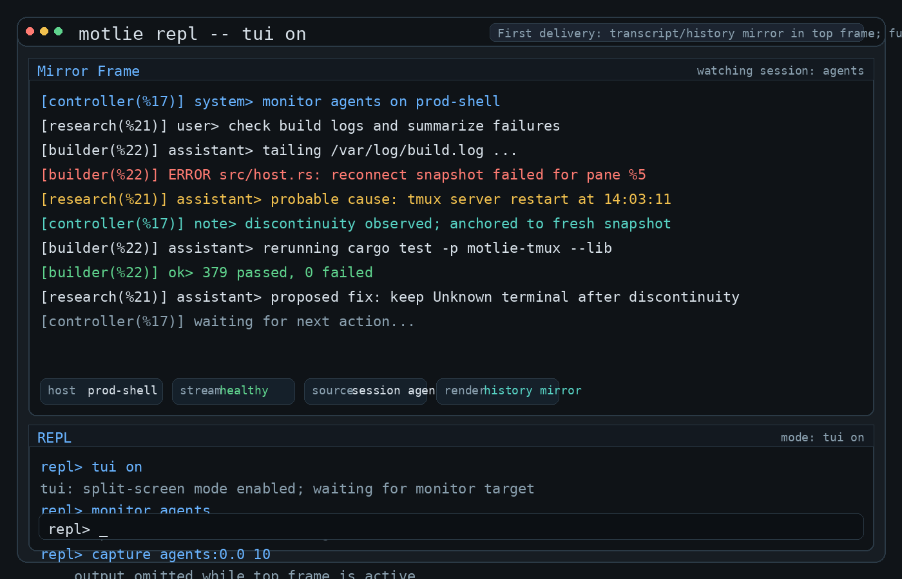
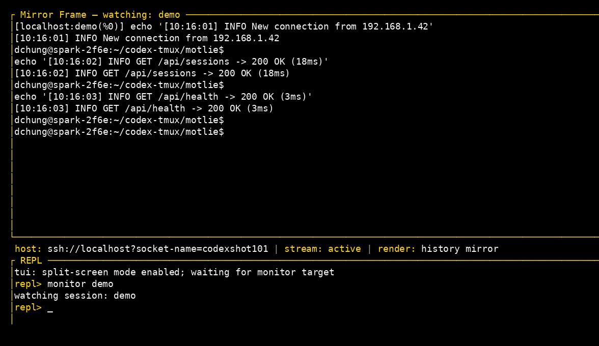

# motlie-tmux Examples

Runnable programs demonstrating the `motlie-tmux` API. Each example connects
via an `ssh://` URI and exercises a specific part of the library.

## Prerequisites

- **Working directory**: all commands assume you are in the workspace root (`motlie/`)
- **tmux** installed and on PATH
- For remote hosts: `ssh-agent` running with keys loaded (`ssh-add`), or an
  explicit identity file via `?identity-file=/path/to/key` in the URI

## Building

Build all examples once, then invoke the binaries directly — avoids
`cargo run` recompilation checks on each invocation.

```sh
cargo build -p motlie-tmux --examples

# Binaries are at target/debug/examples/<name>
./target/debug/examples/uri_connect ssh://localhost
./target/debug/examples/list_sessions ssh://localhost
./target/debug/examples/session_lifecycle ssh://localhost
./target/debug/examples/target_navigate ssh://localhost dev
./target/debug/examples/send_and_capture ssh://localhost
./target/debug/examples/exec_command ssh://localhost "uname -a"
./target/debug/examples/target_spec ssh://localhost "dev:0.0"
./target/debug/examples/repl ssh://localhost
./target/debug/examples/stream_pane ssh://localhost my_session --mode monitor
./target/debug/examples/monitor_pipe ssh://localhost my_session
./target/debug/examples/joined_demo ssh://localhost
./target/debug/examples/joined_demo ssh://localhost --format separator
./target/debug/examples/history_demo ssh://localhost
./target/debug/examples/history_demo ssh://localhost session_a session_b
```

## Examples

All examples accept an SSH URI as the first argument. Default: `ssh://localhost`.

### uri_connect — Minimal connection

Parse a URI, connect, verify by listing sessions.

```sh
cargo run -p motlie-tmux --example uri_connect -- ssh://localhost
cargo run -p motlie-tmux --example uri_connect -- ssh://deploy@prod:2222
cargo run -p motlie-tmux --example uri_connect -- 'ssh://deploy@prod?identity-file=/path/to/key'
```

Expected output:
```
Parsing URI: ssh://localhost
  host=localhost, user=, port=22
Connecting...
Connected. 2 active session(s).
```

### list_sessions — Session discovery

Print a table of all active sessions.

```sh
cargo run -p motlie-tmux --example list_sessions -- ssh://localhost
```

Expected output:
```
NAME                 ID       WINDOWS  ATTACHED
--------------------------------------------------
dev                  $0       3        yes
build                $1       1        no
```

### session_lifecycle — Create, rename, kill

Full lifecycle demonstrating that `rename()` returns a new Target handle.

```sh
cargo run -p motlie-tmux --example session_lifecycle -- ssh://localhost
```

Expected output:
```
Creating session 'motlie_example_lifecycle'...
  Created: target=motlie_example_lifecycle, level=Session
  Confirmed in session list.
Renaming to 'motlie_example_renamed'...
  Renamed: target=motlie_example_renamed, session_name=motlie_example_renamed
  Confirmed rename in session list.
Killing session...
  Confirmed session is gone.
Done.
```

### target_navigate — Hierarchy navigation

Walk the session → window → pane tree, printing metadata at each level.

```sh
# Use an existing session:
cargo run -p motlie-tmux --example target_navigate -- ssh://localhost dev

# Or let it create a temporary session with 2 windows:
cargo run -p motlie-tmux --example target_navigate -- ssh://localhost
```

Expected output (temporary session with 2 windows):
```
Created temporary session 'motlie_example_nav' with 2 windows for demo.
Session: motlie_example_nav (level=Session)
  id=$5, windows=2, attached=false

  Windows (2):
    motlie_example_nav:0 (level=Window)
      name='win0', index=0, active=false, panes=1
      Panes (1):
        motlie_example_nav:0.0 (level=Pane)
          pane_id=%10, index=0
    motlie_example_nav:1 (level=Window)
      name='win1', index=1, active=true, panes=1
      Panes (1):
        motlie_example_nav:1.0 (level=Pane)
          pane_id=%11, index=0

Cleaning up temporary session...
```

### send_and_capture — Input and capture

Send text + Enter to a pane, then capture the visible content.

```sh
cargo run -p motlie-tmux --example send_and_capture -- ssh://localhost
```

Expected output:
```
Sending command...
--- Captured pane content ---
$ echo HELLO_FROM_MOTLIE
HELLO_FROM_MOTLIE
$
--- End ---
Output verified.
Done.
```

### exec_command — Structured execution

Run a shell command inside a tmux pane and get structured output.

```sh
cargo run -p motlie-tmux --example exec_command -- ssh://localhost
cargo run -p motlie-tmux --example exec_command -- ssh://localhost "uname -a"
```

Expected output:
```
Executing: echo hello_from_exec
Exit code: 0
Success:   true
Stdout:
hello_from_exec
```

### target_spec — TargetSpec resolution

Parse and resolve a tmux target string against a live server.

```sh
cargo run -p motlie-tmux --example target_spec -- ssh://localhost "dev"
cargo run -p motlie-tmux --example target_spec -- ssh://localhost "dev:0"
cargo run -p motlie-tmux --example target_spec -- ssh://localhost "dev:0.0"
```

Expected output:
```
Parsed TargetSpec: dev:0.0
  session=dev, window=Some("0"), pane=Some(0)

Resolved target: dev:0.0
  level: Pane
  Pane: pane_id=%0, address=dev:0.0
```

### repl — Interactive session manager

Interactive REPL for managing tmux sessions over SSH. Connects to a host,
then accepts commands in a loop. Exercises session lifecycle, target
resolution, text input, and scrollback capture in a single interactive program.

```sh
cargo run -p motlie-tmux --example repl -- ssh://localhost
./target/debug/examples/repl ssh://localhost
```

#### Design mock vs actual

| Mock (design target) | Actual (`tui on`, live capture) |
|---|---|
|  |  |

The mock shows the aspirational multi-agent scenario with colored source labels,
discontinuity markers, and a richer status bar. The actual screenshot is a live
capture of the shipped `tui on` mode monitoring a real tmux session.

What shipped:
- top mirror frame with `HistoryHandle`-driven rolling transcript
- bottom REPL frame preserving the full command surface
- status bar with `MonitorHealth` state (active/reconnecting/failed/stopped)
- `tui on` / `tui off` mode toggling

#### Commands

| Command | Description | API Used |
|---------|-------------|----------|
| `help` | Show available commands and usage | — |
| `create <name> [--size WxH] [--history N]` | Create a session with optional size and history | `host.create_session()`, `CreateSessionOptions` |
| `new-window <session> <name> [--size WxH]` | Create a child window under a session | `target.new_window()`, `CreateWindowOptions` |
| `split-pane <target> [--horizontal\|--vertical] [--percent N\|--cells N]` | Split a child pane from a window or pane target | `target.split_pane()`, `SplitPaneOptions` |
| `kill <target>` | Kill a session, window, or pane | `target.kill()` |
| `targets` | List all sessions with target spec strings | `host.list_sessions()`, `target.children()` |
| `send <target> <text...>` | Send text + Enter to a target | `target.send_text()`, `target.send_keys()` |
| `keys <target> <keys...>` | Send raw key sequence (`{Escape}`, `{C-c}`, etc.) | `KeySequence::parse()`, `target.send_keys()` |
| `capture <target> <n>` | Print last N scrollback lines | `target.sample_text(LastLines(n))` |
| `monitor <session> [secs]` | Stream live output for N seconds (default 3) | `host.start_monitoring_session()`, `OutputBus`, `JoinedStream` |
| `tui on` | Enter split-screen TUI mirror mode (DC32) | `OutputBus`, `Subscription`, `HistoryHandle`, `ratatui` |
| `tui off` | Return to plain REPL mode (inside TUI only) | — |
| `upload <local> <remote> [--recursive]` | Upload a file or directory to the host | `host.upload()`, `TransferOptions` |
| `download <remote> <local> [--recursive]` | Download a file or directory from the host | `host.download()`, `TransferOptions` |
| `quit` | Disconnect and exit | — |

`create` creates sessions only; hierarchical child creation uses the new first-class
`new-window` and `split-pane` commands, which map to `Target::new_window()` and
`Target::split_pane()`. Optional flags:
- `--size WxH` — set initial window dimensions (e.g. `--size 200x50`)
- `--history N` — set scrollback history limit (e.g. `--history 50000`)

`split-pane` defaults to a vertical split. Use:
- `--horizontal` or `--vertical` to choose direction
- `--percent N` for percentage sizing
- `--cells N` for fixed-size splits

All other commands accept a target string at any granularity: `session`,
`session:window`, or `session:window.pane`. The target resolves to the
corresponding level and the command operates there. For example:
- `kill dev` kills the entire session
- `kill dev:0` kills window 0
- `kill dev:0.1` kills pane 1 of window 0
- `send dev:0.1 ls` sends to a specific pane
- `capture dev 10` captures the active pane of the session

#### Expected output

```
Connected to ssh://localhost
repl> targets
  dev                  (Session, 3 windows)
    dev:0              (Window, 'editor', 2 panes)
      dev:0.0          (Pane, %0)
      dev:0.1          (Pane, %1)
    dev:1              (Window, 'shell', 1 pane)
      dev:1.0          (Pane, %2)
    dev:2              (Window, 'logs', 1 pane)
      dev:2.0          (Pane, %3)
repl> create test_session
Created: test_session
repl> create automation --size 200x50 --history 50000
Created: automation (200x50) history=50000
repl> new-window automation logs --size 160x40
Created window: automation:1
repl> split-pane automation:1 --horizontal --percent 40
Created pane: automation:1.1
repl> send test_session echo hello from repl
Sent to test_session
repl> keys test_session {Escape}
Sent keys to test_session
repl> keys test_session {C-c}
Sent keys to test_session
repl> capture test_session 5
$ echo hello from repl
hello from repl
$
repl> upload /tmp/config.toml /opt/myapp/config.toml
Uploaded /tmp/config.toml → /opt/myapp/config.toml
repl> upload ./deploy /opt/myapp --recursive
Uploaded ./deploy → /opt/myapp
repl> download /var/log/myapp.log /tmp/myapp.log
Downloaded /var/log/myapp.log → /tmp/myapp.log
repl> kill test_session
Killed: test_session
repl> quit
Disconnected.
```

#### Split-screen TUI mode (DC32)

`tui on` enters a split-screen mode powered by `ratatui`:

- **Top frame**: live mirror of a watched remote session transcript
- **Bottom frame**: REPL prompt and command history
- **Status bar**: host, stream health, render mode

TUI mode preserves the core REPL command surface — `monitor`, `create`, `kill`,
`targets`, `send`, `keys`, `capture`, `help`, `tui off`, and `quit` all work
in the bottom frame. The status bar surfaces actual `MonitorHealth` state
(`active`, `reconnecting`, `failed`, `stopped`) rather than just watch presence.
Use `tui off` to return to plain REPL mode, or `quit` / Ctrl-C to exit.

The TUI mirror consumer lives entirely in the example binary — it does not
add any terminal dependencies to `libs/tmux` (consistent with DC11 and DC32).

### stream_pane — Continuous pane streaming

Demonstrates the distinct capture and streaming techniques in the library.
Use `--mode` to select a strategy. Ctrl-C exits cleanly in all modes.
Run with `-h` for detailed help on all modes and options.

The first four modes are **poll-based** — they sample pane content at intervals.
The `monitor` mode is **event-driven** — it uses tmux control mode to receive
output events in real-time with no polling.

| Mode | API Used | Behavior |
|------|----------|----------|
| `tail` (default) | `sample_text(LastLines(n))` + `overlap_deduplicate()` | Like `tail -f` — prints only new scrollback lines |
| `visible` | `capture()` | Polls visible pane; reprints on change. Best for TUI programs |
| `until` | `sample_text(Until { pattern, max_lines })` | Scans back to regex match, shows everything since (e.g. last prompt) |
| `fidelity` | `capture_with_options(detect_reflow: true)` | Polls with geometry snapshots; shows content + fidelity status |
| `monitor` | `start_monitoring_session()` + `OutputBus` + `JoinedStream` | Event-driven via control mode — real-time, multi-pane, source-labeled |

```sh
# Default: tail mode (incremental scrollback with overlap dedup)
./target/debug/examples/stream_pane ssh://localhost my_session

# Watch visible pane content (good for TUI programs like htop, vim)
./target/debug/examples/stream_pane ssh://localhost my_session --mode visible

# Tail with custom line count and poll interval
./target/debug/examples/stream_pane ssh://localhost my_session --mode tail --lines 100 --interval 500

# Show everything since last shell prompt (scan backwards until pattern)
./target/debug/examples/stream_pane ssh://localhost my_session --mode until --pattern '^\$ '

# Fidelity mode — try resizing the target terminal to see degradation
./target/debug/examples/stream_pane ssh://localhost my_session --mode fidelity

# Event-driven monitoring — real-time output, no polling
./target/debug/examples/stream_pane ssh://localhost my_session --mode monitor

# Stream a specific pane
./target/debug/examples/stream_pane ssh://localhost "my_session:0.1" --lines 30
```

Expected output (`--mode tail`):
```
Streaming my_session [mode=tail, lines=50, interval=200ms]. Ctrl-C to stop.
$ echo hello
hello
$ make test
running 42 tests...
test result: ok. 42 passed; 0 failed
^C
Stopped.
```

Expected output (`--mode monitor`):
```
Monitoring my_session [mode=monitor, event-driven]. Ctrl-C to stop.
--- my_session:0.0 ---
$ echo hello
hello
$
--- my_session:0.1 ---
running 42 tests...
test result: ok. 42 passed; 0 failed
^C
Stopped.
```

Expected output (`--mode fidelity`, after resizing the target terminal):
```
$ echo hello
hello
$

 DEGRADED: ClientResize, PaneResize
```

### monitor_pipe — Sink pipeline monitoring

Demonstrates the terminal-consumer side of Track A: start a session monitor,
subscribe to the `OutputBus`, route events through `Subscription::pipe()`, and
teardown cleanly with `PipeHandle`.

This example also works against non-default tmux sockets. If the URI includes
`socket-name` or a socket path, the control-mode monitor attaches to that same
server instead of the default tmux socket.

Supported sinks:
- `prefixed` — `StdioSink::Prefixed`
- `raw` — `StdioSink::Raw`
- `json` — `StdioSink::Json`
- `callback` — `CallbackSink` with custom formatting and flush summary

```sh
# Default prefixed stdio sink
./target/debug/examples/monitor_pipe ssh://localhost my_session

# JSON sink output
./target/debug/examples/monitor_pipe ssh://localhost my_session --sink json

# Custom callback sink with summary on flush
./target/debug/examples/monitor_pipe ssh://localhost my_session --sink callback --seconds 5

# Monitor a named tmux socket
./target/debug/examples/monitor_pipe 'ssh://localhost?socket-name=myserver' my_session
```

Expected output (`--sink prefixed`):
```text
Monitoring my_session for 3s using prefixed sink. Ctrl-C to stop early.
Flow: start_monitoring_session -> output_bus.subscribe -> pipe -> unsubscribe -> join
[localhost] %5 | $ echo hello
[localhost] %5 | hello
[localhost] %6 | running tests...
Stopped.
```

Expected output (`--sink callback`):
```text
Monitoring my_session for 5s using callback sink. Ctrl-C to stop early.
Flow: start_monitoring_session -> output_bus.subscribe -> pipe -> unsubscribe -> join
[callback localhost %5] $ echo hello
[callback localhost %5] hello
Callback summary: data_events=2, gap_events=0, dropped_events=0
Stopped.
```

### joined_demo — Multi-pane JoinedStream

Demonstrates `JoinedStream` merging output from two panes in a single session.
Creates a 2-pane session using `Target::split_pane()`, sends different commands
to each pane, and shows the interleaved output with source attribution.

```sh
# Default: bracketed labels on every line
./target/debug/examples/joined_demo ssh://localhost

# Separator mode: header only on source transitions
./target/debug/examples/joined_demo ssh://localhost --format separator

# Prompt-style labels
./target/debug/examples/joined_demo ssh://localhost --format prompt
```

Expected output (`--format bracketed`):
```text
--- JoinedStream output ---
[localhost:joined_demo_12345(%5)] ps aux | head -5
[localhost:joined_demo_12345(%5)] USER         PID %CPU %MEM  ...
[localhost:joined_demo_12345(%5)] root           1  0.0  0.0  ...
[localhost:joined_demo_12345(%6)] ls -la /tmp | head -5
[localhost:joined_demo_12345(%6)] total 218368
[localhost:joined_demo_12345(%6)] drwxrwxrwt 35 root   root   ...
--- end ---
```

Expected output (`--format prompt`):
```text
--- JoinedStream output ---
localhost:joined_demo_12345(%5)> ps aux | head -5
localhost:joined_demo_12345(%5)> USER         PID %CPU %MEM  ...
localhost:joined_demo_12345(%6)> ls -la /tmp | head -5
--- end ---
```

Expected output (`--format separator`):
```text
--- JoinedStream output ---
--- localhost:joined_demo_12345(%5) ---
ps aux | head -5
USER         PID %CPU %MEM    VSZ   RSS TTY      STAT START   TIME COMMAND
root           1  0.0  0.0  23580 14240 ?        Ss   Mar10   2:30 /sbin/init
--- localhost:joined_demo_12345(%6) ---
ls -la /tmp | head -5
total 218368
drwxrwxrwt 35 root   root     118784 Mar 19 21:42 .
--- end ---
```

### history_demo — Rolling LLM context from two chat traces

Demonstrates the history API for external-agent workflows. Supports two modes:

**Simulated mode** (default): creates a 2-pane session where each pane simulates
another agent's chat trace, replays scripted turns, and prints the rolling
`render_text()` context after each turn.

**Live mode** (two session names): polls two existing tmux sessions and builds
a combined rolling history from their output. Live mode captures a startup
baseline, then appends only new changes while it runs.

This is the clearest tutorial for the intended Track B shape:
- `OutputBus::subscribe()`
- `Subscription::history()`
- `HistoryHandle::render_text()`
- a bounded, source-labeled context window ready for an external LLM/classifier

```sh
# Simulated mode — scripted two-pane demo
./target/debug/examples/history_demo ssh://localhost

# Larger rolling context window
./target/debug/examples/history_demo ssh://localhost --chars 520 --entries 10

# Live mode — compact tail-style polling from two existing sessions
./target/debug/examples/history_demo ssh://localhost agent_session build_session --mode tail

# Live mode — rendered snapshot polling
./target/debug/examples/history_demo ssh://localhost sess_a sess_b --mode render

# Live mode with custom rolling window
./target/debug/examples/history_demo ssh://localhost sess_a sess_b --mode tail --chars 1000 --entries 20

# Remote host with explicit SSH key
./target/debug/examples/history_demo 'ssh://deploy@prod?identity-file=/path/to/key'
```

Expected output (simulated mode):
```text
Session: history_demo_12345
Simulating two chat traces: history_demo_12345:0.0 and history_demo_12345:0.1
History window: max_entries=8, max_render_chars=420

=== rolling context after turn 1 ===
localhost:history_demo_12345(%5)> agent-a> I found the failing assertion in monitor.rs.

=== rolling context after turn 2 ===
localhost:history_demo_12345(%5)> agent-a> I found the failing assertion in monitor.rs.

localhost:history_demo_12345(%6)> agent-b> Verify the shared OutputBus is injected before monitoring starts.

=== rolling context after turn 6 ===
[... 3 earlier entries omitted ...]
localhost:history_demo_12345(%6)> agent-b> Good. Check custom label budgeting in HistoryHandle.
localhost:history_demo_12345(%5)> agent-a> rendered_chars now measures the fully rendered line.
localhost:history_demo_12345(%6)> agent-b> Great. Update DESIGN and API to match the shipped contract.

Final snapshot: entries=3, omitted_entries=3, rendered_chars=...

Expected output (live mode):
```text
Polling live sessions: claude-tmux and codex-tmux [mode=tail]
History window: max_entries=8, max_render_chars=420
Baseline captured at startup; only new changes are appended.
Ctrl-C to stop.

=== rolling context (t=2s) ===
claude-tmux(%1)> echo HISTORY_TAIL_TIGHTEN4
  HISTORY_TAIL_TIGHTEN4
codex-tmux(%0)> echo HISTORY_TAIL_TIGHTEN4_CODEX
  HISTORY_TAIL_TIGHTEN4_CODEX
```

Live mode now has two polling strategies:
- `--mode tail`: compact pane-tail excerpts when a pane changes
- `--mode render`: append full rendered pane snapshots when the visible state changes

The simulated mode still demonstrates the full monitor -> OutputBus ->
Subscription -> HistoryHandle pipeline. Live mode is intentionally poll-based
for reliability on long-lived remote sessions.
```

Expected output (live mode):
```text
Monitoring live sessions: agent_session and build_session
History window: max_entries=8, max_render_chars=420
Ctrl-C to stop.

=== rolling context (t=1s) ===
localhost:agent_session(%5)> $ cargo test
localhost:build_session(%8)> running lint checks...

=== rolling context (t=2s) ===
localhost:agent_session(%5)> $ cargo test
localhost:agent_session(%5)> running 42 tests...
localhost:build_session(%8)> running lint checks...
localhost:build_session(%8)> lint: ok
^C

Final snapshot: entries=4, omitted_entries=0, rendered_chars=...
```

Why this matters:
- it shows the exact rolling prompt context an external reasoning agent would consume
- the source labels identify which agent trace produced each line
- trimming and omission markers are explicit instead of silently dropping earlier context
- live mode lets you point at real sessions without scripted content
