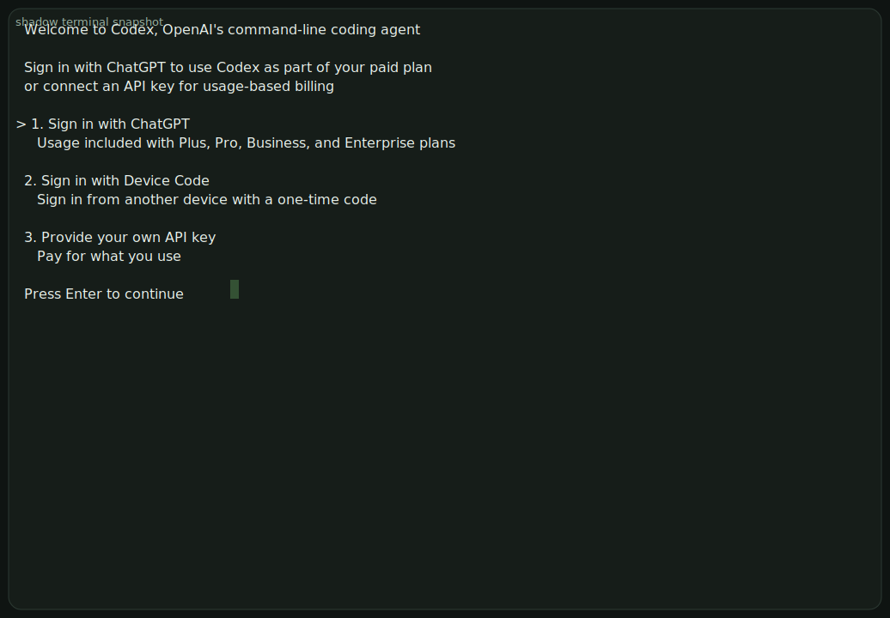

# v1.4 Harness

## Changelog

| Date | Who | Summary |
|------|-----|---------|
| 2026-04-08 | @codex | Add `wait_egress_ready` as a first-class scenario/readiness primitive so manual certification and saved validations stop relying on one opportunistic HTTPS probe; the harness now treats DNS + outbound HTTPS to the certification targets as a distinct gate |
| 2026-04-08 | @codex | Address PR 140 review drift in the harness contract: make the repo-root working-directory assumption explicit, document that `ready.timeout_ms` is currently applied per readiness sub-phase instead of as one wall-clock budget, and keep the recorded-artifact guidance aligned with the live harness behavior |
| 2026-04-08 | @codex | Add Rust-native static SVG export from the harness-rendered VTE snapshot, check in a repo-local `pty-agent-validation.svg`, and use that as the GitHub-friendly review surface while keeping asciicast as the replay artifact |
| 2026-04-08 | @codex | Replace the temporary branch-local HTML replay surface with a hosted asciinema link and preview image, and remove the extra local player/Pages scaffolding to keep the review path minimal |
| 2026-04-08 | @codex | Add a small checked-in HTML replay surface for the saved PTY validation cast and link it from README/HARNESS so the branch has a concrete review entrypoint for recorded shell sessions |
| 2026-04-08 | @codex | Clarify PTY sequencing for shell-driven scenarios: after visible command output assertions, wait for the shell prompt to return before sending the next command, or TUI launches can race the prior command tail |
| 2026-04-08 | @codex | Add `wait_package_manager_quiescent` as a first-class scenario action so saved scenarios stop embedding the long package-manager idle shell loop inline |
| 2026-04-08 | @codex | Quieten the bootstrap/PTY validation path: wait for package-manager background activity to settle before running `apt-get update`, so saved scenarios record one clean apt run instead of transient first-boot lock contention |
| 2026-04-08 | @codex | Add the switchable terminal-backend contract: `shadow` is now the default PTY/TUI renderer, `vt100` remains as a fallback flag, `pty-screen.json` records the backend used, and PNG/GIF/movie output stays out of scope for `v1.4` |
| 2026-04-08 | @codex | Add asciicast as the portable PTY replay/export artifact, keep NDJSON transcript + VTE screen JSON as the canonical agent-facing validation artifacts, and explicitly mark PNG/GIF/movie generation out of scope for `v1.4` |
| 2026-04-08 | @codex | Expand HARNESS into the future-agent operating contract: design goals, autonomous workflow, troubleshooting loop, artifact/log usage, and standard verification matrix now explicitly include `agent-bootstrap.json` and the recommended shell-vs-scenario decision path |
| 2026-04-08 | @codex | Add `apt-get update` to the baseline agent/bootstrap validation and document the default egress allocator compatibility rule: keep slot-based capacity growth, but start the guest-facing vnet range at `10.0.2.0/24` so harness egress stays aligned with the previously validated path |
| 2026-04-08 | @codex | Promote HARNESS from a runbook to the harness contract and evolution log: document the stable JSON scenario format, shell/wrapper layering, allocator UX, and PTY/VTE artifacts for future agent-driven troubleshooting and feature work |
| 2026-04-07 | @codex | Add the first `harness_v1_4` runbook covering smoke, shell, multi-guest wrappers, and live SSH validation |

## Purpose

The `v1.4` harness is the primary automation and troubleshooting surface for
`libs/vmm`.

Success for this harness design is not merely "smoke tests pass". Success is:

- a future coding agent can boot isolated harness instances without human setup
- the agent can reproduce product bugs through `vfs`, `vnet`, SSH proxy, and
  PTY flows
- the agent can inspect host-side state, guest-side state, serial logs, launch
  logs, and terminal sessions from one harness run
- the agent can codify the reproduction as a saved scenario and reuse it for
  validation while iterating on a fix

This is why the harness now has both:

- a stable machine-readable scenario format
- thin convenience wrappers (`*.sh`) for common end-to-end flows

The scenario format is the durable contract. The shell wrappers are convenience
entrypoints and compatibility checks.

## Design Goals

Functional goals:

- boot one or more isolated guests through the `libs/vmm` API
- validate `vfs`, `vnet`, SSH proxy, PTY, and guest tooling behavior through
  the same end-to-end path a real user or agent would exercise
- capture enough machine-readable evidence that another agent can reconstruct
  what happened without rerunning immediately
- make bug reproduction, bug fixing, and feature validation use the same
  harness substrate instead of ad hoc scripts

Non-functional goals:

- deterministic enough for CI and repeated agent use
- reviewable in PRs
- explicit about runtime paths, network allocation, and artifact ownership
- isolated per harness run so multiple agents can work concurrently

Non-goals for `v1.4`:

- a fully general workflow language with branching, looping, and variables
- replacing every wrapper or manual probe immediately
- human-first recording formats as the primary artifact contract

Success criteria for this harness design:

- a future agent can start from this document, choose the right harness mode,
  reproduce a problem, inspect artifacts, codify the repro as a scenario,
  validate a fix, and leave behind reviewable evidence without human
  intervention

## Agent Operating Model

Unless otherwise noted, command examples in this document assume the repo root
working directory:

```bash
cd /tmp/vmm-v1.4
```

Use the harness in this order:

1. run a standard saved scenario if one already matches the problem
2. use `shell` when exploring, bisecting, or discovering a new reproduction
3. use live external SSH when the exact interactive login or TUI behavior
   matters
4. once the repro is understood, encode it as a saved scenario and rerun it
   through `scenario`

For manual certification handoff, do not stop at `boot` + `ready`. Run
`validate <guest>` or a saved scenario that includes `wait_egress_ready`
first, then attach over external SSH.

Choose the mode by purpose:

- `smoke`: fast single-guest health check of the current harness/image path
- `scenario`: preferred durable validation and CI/agent contract
- `shell`: exploration, triage, one-off commands, PTY probing, runtime
  discovery
- `integration/*.sh`: compatibility wrappers and external-SSH regression checks

The desired agent loop is:

1. establish baseline health with `smoke` or `agent-bootstrap.json`
2. reproduce the problem in `shell` or a focused scenario
3. inspect `where <guest>`, launch logs, serial logs, PTY artifacts, and result
   JSON
4. change code
5. rerun the smallest relevant saved scenario
6. rerun the standard verification matrix before checkpoint/push

## Layering

The harness stack is intentionally split:

1. `harness_v1_4 scenario <file.json>`
   - stable machine-driven contract
   - deterministic action/expectation steps
   - machine-readable per-step results
   - PTY transcript and VTE screen artifacts
2. `harness_v1_4 shell`
   - ad-hoc/manual control surface
   - first customer for allocator UX and runtime discovery
   - useful for debugging, one-off exploration, and live SSH attach
3. `integration/*.sh`
   - thin wrappers over harness behavior
   - useful for regression convenience and external SSH checks
   - should avoid reimplementing orchestration logic that belongs in the
     harness itself

The shell wrappers still matter because real external `ssh -tt` behavior caught
bugs that pure `exec` did not. But the harness owns the reusable scenario
contract.

## Preconditions

Work from:

```bash
cd /tmp/vmm-v1.4
```

Build or rebuild the guest image when guest contents or overlay behavior
changes:

```bash
./libs/vmm/examples/v1.4/build-guest.sh
```

Build the harness:

```bash
cargo build -p motlie-vmm --example harness_v1_4
```

Terminal backend selection:

```bash
./target/debug/examples/harness_v1_4 --terminal-backend shadow ...
./target/debug/examples/harness_v1_4 --terminal-backend vt100 ...
```

The default is `shadow`. Use `vt100` only as an explicit fallback or
comparison/debugging mode.

## Core Modes

### `smoke`

Fast single-guest lifecycle smoke over the extracted library API:

```bash
./target/debug/examples/harness_v1_4
./target/debug/examples/harness_v1_4 --result-json /var/tmp/motlie-v14/smoke-result.json
```

This covers:

- boot
- readiness
- `exec`
- `vfs`
- passwordless sudo and baseline guest tooling
- `vnet` route and outbound HTTPS
- Debian package index refresh over `vnet`
- shutdown

### `pty`

Single-guest PTY/VTE smoke:

```bash
./target/debug/examples/harness_v1_4 pty
```

This covers:

- PTY open
- login banner / MOTD capture
- prompt interaction
- terminal resize
- raw PTY transcript capture
- rendered terminal state capture
- asciicast replay/export
- terminal close/exit evidence

### `scenario`

Stable machine-readable scenario driver:

```bash
./target/debug/examples/harness_v1_4 scenario \
  ./libs/vmm/examples/v1.4/scenarios/pty-login.json
```

Multi-guest example:

```bash
./target/debug/examples/harness_v1_4 scenario \
  ./libs/vmm/examples/v1.4/scenarios/multiguest-validate.json
```

Auto-provisioning example:

```bash
./target/debug/examples/harness_v1_4 scenario \
  ./libs/vmm/examples/v1.4/scenarios/auto-provision-ssh.json
```

The scenario mode is the preferred non-interactive surface for future agent
work.

When an agent is uncertain where to start, default to:

```bash
./target/debug/examples/harness_v1_4 scenario \
  ./libs/vmm/examples/v1.4/scenarios/agent-bootstrap.json
```

That is the baseline “can this guest support autonomous agent work?” check.

### `shell`

Ad-hoc/manual harness shell:

```bash
./target/debug/examples/harness_v1_4 shell
```

Optional root override:

```bash
./target/debug/examples/harness_v1_4 shell --root /var/tmp/motlie-v14
```

Or:

```bash
MOTLIE_VMM_ROOT=/var/tmp/motlie-v14 ./target/debug/examples/harness_v1_4 shell
```

Useful shell commands now include:

```text
capacity
where
where alice
boot alice
exec alice /bin/uname -s
pty-open alice alice-shell
pty-expect alice-shell Start tmux session?
pty-send-line alice-shell n
pty-screen alice-shell
pty-resize alice-shell 120 40
shutdown alice
quit
```

Each harness run allocates its own namespace and roots, for example:

```text
v1.4 harness instance: motlie-vmm-v14-h12345
  demo_root=/var/tmp/motlie-v14/motlie-vmm-v14-h12345-demo
  socket_root=/var/tmp/motlie-v14/motlie-vmm-v14-h12345-sockets
  proxy=ssh://localhost:34345
```

## Scenario Format

The canonical format is JSON. JSON is intentional:

- agents already generate it reliably
- it is unambiguous in PR review
- it maps directly to machine-readable results
- it avoids inventing a bespoke parser before the action model stabilizes

Canonical top-level shape:

```json
{
  "name": "pty-login",
  "description": "Boot alice and validate the PTY login path.",
  "steps": [
    { "action": "boot", "guest": "alice" },
    { "action": "ready", "guest": "alice" },
    {
      "action": "pty_open",
      "guest": "alice",
      "session": "alice-shell",
      "cols": 80,
      "rows": 24
    },
    {
      "action": "pty_expect",
      "session": "alice-shell",
      "contains": "alice@motlie-alice",
      "timeout_ms": 10000
    },
    { "action": "shutdown", "guest": "alice" }
  ]
}
```

Supported actions today:

- `boot`
- `ready`
- `exec`
- `proxy_exec`
- `wait_egress_ready`
- `wait_package_manager_quiescent`
- `pty_open`
- `pty_send`
- `pty_send_line`
- `pty_read`
- `pty_resize`
- `pty_expect`
- `pty_expect_screen`
- `pty_expect_terminal`
- `pty_snapshot`
- `shutdown`

Current expectation model:

- `exec` supports `expect.exit_code`, `expect.stdout_contains`,
  `expect.stderr_contains`
- `proxy_exec` opens a fresh localhost SSH session against the russh proxy as
  the supplied principal; this is the preferred way to prove first-contact
  auto-provisioning and guest reuse behavior
- `wait_egress_ready` is the first harness-native network certification gate;
  it waits for DNS resolution of `example.com` and `www.google.com`, then
  waits for outbound HTTPS success against `https://example.com` and
  `https://www.google.com/generate_204`
- `wait_package_manager_quiescent` is the first built-in readiness-style
  scenario action; use it instead of inlining the `apt`/`dpkg` idle loop in
  JSON
- PTY expectations are explicit step actions instead of being hidden in
  shell-wrapper `grep` chains
- use `pty_expect` for new incremental PTY output and `pty_expect_screen` for
  assertions against the current rendered VTE buffer
- `pty_expect_screen` is a timed wait over the VTE buffer, so it can validate
  alternate-screen TUIs such as Codex instead of only checking an immediate
  snapshot
- `ready.timeout_ms` is currently expanded into one equal timeout per
  readiness sub-phase (`api_socket`, `guestfs`, `ssh_bridge`, `exec_ready`);
  it is not yet one wall-clock budget across the whole ready step
- when driving an interactive shell through sequential commands, wait for the
  prompt to reappear before sending the next command, even if the previous
  command's success marker is already visible

Current limits:

- steps run sequentially
- there is no branching or looping
- `validate` is not yet a first-class scenario action
- shell mode is not yet a thin frontend over the exact same engine

Those are acceptable `v1.4` limits. The important part is that saved
reproductions are now harness-native and reviewable.

Scenario authoring guidance:

- prefer one scenario per concrete repro or validation goal
- keep step names implicit in the action sequence; keep descriptions concise
- use `exec` for invariant host/guest checks and `pty_*` actions when terminal
  behavior itself is under test
- if an interaction was first discovered manually in `shell`, convert it into a
  saved scenario before considering the issue closed

## PTY / VTE Artifacts

The harness now keeps both raw and rendered terminal state.

Per PTY session it writes:

- `pty-transcript.ndjson`
- `pty-screen.json`
- `pty-screen.svg`
- `pty.cast`

Checked-in replay entrypoints for the saved agent-validation session:

- [`assets/pty-agent-validation.svg`](./assets/pty-agent-validation.svg)
- [`assets/pty-agent-validation.cast`](./assets/pty-agent-validation.cast)

GitHub-friendly snapshot:



The rendered screen JSON now records which terminal backend produced it.

Why both:

- raw transcript is the source-of-truth event stream
- rendered VTE screen state is what agents and humans usually reason about

Backend contract:

- `shadow` is the default PTY/TUI backend because it produces a much cleaner
  rendered screen for Codex and other alternate-screen applications
- `vt100` remains available behind `--terminal-backend vt100` as a lightweight
  fallback/debugging parser
- the raw `pty.cast` replay remains control-sequence-heavy by design; clean
  assertions should target `pty-screen.json`

Why NDJSON for the raw transcript instead of one large pretty JSON array:

- easier for agents to stream and chunk
- cheaper to append and inspect
- smaller and less awkward than one giant nested JSON blob

Why JSON for the rendered screen:

- agents want direct structured access to rows, cols, cursor position, and
  visible text
- the rendered screen is a snapshot, so one structured JSON object is natural

This means the harness artifact strategy is:

- `scenario-result.json` for high-level structured results
- `pty-transcript.ndjson` for compact raw terminal events
- `pty-screen.json` for rendered terminal state
- `pty-screen.svg` for a GitHub-renderable static screen snapshot
- `pty.cast` for portable replay/export

That split is more useful for agents than either:

- raw bytes only
- giant pretty transcript JSON only

Why asciicast is included:

- it preserves terminal input/output/resize flow in a portable replay format
- agents can still parse it because it is structured timed terminal data, not
  pixels
- humans can replay it with asciinema-compatible viewers on Linux, macOS, or
  the web
- the static SVG covers the GitHub-rendered documentation case, while the cast
  remains the full replay artifact

Out of scope for `v1.4`:

- PNG screenshots as a standard harness artifact
- GIF/MP4/movie generation as part of standard validation

Those are human-review outputs and can be layered on later if needed, but they
are not the primary harness contract for autonomous agents.

## Machine-Readable Result Shape

`smoke` and `pty` still emit the legacy top-level harness result envelope.

`scenario` emits the scenario-native result envelope, including:

- overall status
- scenario name and description
- artifact root
- proxy URI
- allocator capacity
- per-step result records
- per-session artifact paths
- structured classified error record on failure

Step results include:

- action
- guest/session identity when relevant
- detail string
- `exec` output when relevant
- PTY read output when relevant
- rendered screen snapshot when relevant
- shutdown report when relevant

This is intended to be directly consumable by agents and CI.

For future agent use, the important rule is:

- treat the result JSON as the top-level verdict and index
- treat launch logs, serial logs, transcript NDJSON, screen JSON, and
  asciicast as the evidence backing that verdict

## Artifacts and Runtime Discovery

Every harness run prints a namespace, root paths, and SSH proxy URI.

Use `where` and `where <guest>` in shell mode to discover:

- demo roots and socket roots
- runtime directories
- cloud-init directories
- launch logs and serial logs
- guest slot/CID/admin/egress allocation
- vnet socket and vsock socket paths

Use these artifacts by problem type:

- boot or cloud-init failure:
  inspect `launch.log`, `serial.log`, and `cloud_init_dir`
- `vfs` mount problem:
  inspect host-side `home_host`, `workspace_host`, `agent_state_host`, then
  validate in guest with `exec` or external SSH
- `vnet` or egress problem:
  inspect `ip route`, `ip neigh`, `/etc/resolv.conf`, then compare against
  allocator output from `where <guest>`
- PTY/TUI problem:
  inspect `pty-transcript.ndjson`, `pty-screen.json`, and `pty.cast`, then
  attach with live SSH if needed
- proxy/login problem:
  use the printed `ssh://localhost:<port>` endpoint and the wrapper scripts

## Autonomous Troubleshooting Workflow

When a future agent sees a failure, use this sequence:

1. rerun the relevant scenario with `--result-json`
2. inspect the classified failure in the result file
3. if the failure is not already obvious, rerun in `shell`
4. use `boot <guest>`, `where <guest>`, `validate <guest>`, and PTY commands
   to narrow the issue
5. if the problem is interactive, attach over SSH or open a PTY session
6. once understood, either:
   - fix the code and rerun the saved scenario
   - or create a new scenario capturing the missing reproduction

The harness is considered successful only if an agent can move from “something
failed” to “here is a stable repro plus evidence plus fix validation” using
this loop.

## Allocator UX

The harness is the first customer of the new allocation API.

CLI overrides:

```bash
./target/debug/examples/harness_v1_4 shell \
  --max-guests 64 \
  --first-cid 100 \
  --admin-base 172.22.0.0/16 \
  --admin-guest-prefix 30 \
  --egress-base 10.32.0.0/12 \
  --egress-guest-prefix 24
```

Shell inspection:

```text
capacity
where
where alice
```

`capacity` shows:

- configured base pools
- per-guest subnet size
- computed capacity
- next slot and remaining capacity

`where <guest>` now shows:

- slot
- CID
- admin subnet/IP/MAC
- egress subnet/IP/MAC
- runtime paths and logs

Default policy today:

- admin base `172.20.0.0/16`, guest `/30`
- egress base `10.0.0.0/8`, guest `/24`
- default effective capacity `16384`

This replaces the old implicit 7-guest stopgap.

## Scenario Examples

Saved examples live in:

- [`scenarios/agent-bootstrap.json`](./scenarios/agent-bootstrap.json)
- [`scenarios/pty-login.json`](./scenarios/pty-login.json)
- [`scenarios/multiguest-validate.json`](./scenarios/multiguest-validate.json)
- [`scenarios/auto-provision-ssh.json`](./scenarios/auto-provision-ssh.json)

The multi-guest example proves the stable format is not single-guest-only:

- boot `alice`
- boot `bob`
- validate guest-specific `vfs` content
- validate guest-specific `vnet` routing
- validate outbound HTTPS
- shut both guests down

The agent bootstrap example is the baseline future-agent scenario:

- boot `alice`
- verify `vfs` is mounted
- verify `sudo -n true`
- verify `git` is preinstalled
- verify `codex --version`
- verify outbound HTTPS
- wait for package-manager background activity to settle
- verify one clean `sudo -n apt-get update`
- shut the guest down

The auto-provisioning example proves the SSH principal path:

- connect to the localhost SSH proxy as an unknown principal (`joe`)
- verify that first contact boots a new guest and captures its running identity
- connect again as `joe` and prove the same running guest is reused
- shut the auto-provisioned guest down

Use the scenario for harness-owned regression coverage and
`integration/repl-auto-provision-smoke.sh` for the real external `ssh`
client path against `repl_host_v1_4`.

Current allocator compatibility note:

- the harness still uses the slot-derived allocation API and larger capacity
  model
- the default egress pool now reserves child slots `0` and `1`, so slot `0`
  starts at `10.0.2.0/24`
- this keeps the first harness guests aligned with the previously validated
  libslirp/guest path while still allowing capacity growth well beyond `7`

## Shell and Wrapper Flows

Main multi-guest wrapper:

```bash
./libs/vmm/examples/v1.4/integration/harness-shell-smoke.sh
```

Isolation wrapper:

```bash
./libs/vmm/examples/v1.4/integration/harness-isolation-smoke.sh
```

These still matter because they validate:

- shell UX
- multi-guest bring-up from the harness shell
- live external SSH login behavior
- concurrent harness isolation

But the wrappers should stay thin. New orchestration logic belongs in the
harness scenario engine, not in bash.

REPL auto-provision wrapper:

```bash
./libs/vmm/examples/v1.4/integration/repl-auto-provision-smoke.sh
```

This wrapper exists specifically for the proxy-owned auto-provision path that
cannot be proven by `boot <guest>`:

- launch `repl_host_v1_4`
- parse the printed proxy port
- run a real external `ssh joe@localhost uname -s`
- verify the command returns `Linux`
- query REPL `status`
- attach again as the same principal and verify the same guest PID is reused

Saved shell command sequence:

```bash
cat ./libs/vmm/examples/v1.4/setup-multiguest.harness
```

## Live External SSH

When validating real login UX, use the printed proxy port:

```bash
ssh -o StrictHostKeyChecking=no -o UserKnownHostsFile=/dev/null -p 38306 alice@localhost
ssh -o StrictHostKeyChecking=no -o UserKnownHostsFile=/dev/null -p 38306 bob@localhost
ssh -o StrictHostKeyChecking=no -o UserKnownHostsFile=/dev/null -p 38306 joe@localhost
```

Useful manual probes:

```bash
pwd
sudo -n true
sudo -n apt-get update
sudo -n apt-get install -y git
cat ~/.env
ls -ald /home/$USER /workspace /agent-state
curl -fsSL https://example.com -o ~/example.html && stat ~/example.html
ip route
cat /etc/resolv.conf
```

This path remains important because `exec` success does not prove full external
interactive SSH correctness.

Current expected guest privilege model:

- `alice` and `bob` should have passwordless sudo through
  `/etc/sudoers.d/90-motlie-demo`
- `sudo -n true` should succeed without prompting
- harness validations should wait for package-manager quiescence before
  running `sudo -n apt-get update`
- `sudo -n apt-get update` should then succeed without DNS or route failures
- `git` should already be present in the base image

## Standard Verification

For normal harness or image work, the minimum standard verification is:

1. `cargo test -p motlie-vmm --lib`
2. `cargo build -p motlie-vmm --example harness_v1_4`
3. `./target/debug/examples/harness_v1_4 scenario ./libs/vmm/examples/v1.4/scenarios/agent-bootstrap.json`
4. `./target/debug/examples/harness_v1_4 pty`

For multi-guest or allocator changes, also run:

1. `./target/debug/examples/harness_v1_4 scenario ./libs/vmm/examples/v1.4/scenarios/multiguest-validate.json`
2. `./libs/vmm/examples/v1.4/integration/harness-shell-smoke.sh`

For login, banner, TUI, PTY, or proxy changes, also run:

1. `./libs/vmm/examples/v1.4/integration/harness-isolation-smoke.sh`
2. `./libs/vmm/examples/v1.4/integration/repl-auto-provision-smoke.sh`
3. a live external SSH attach and manual probe

If a future agent changes `vnet`, allocator defaults, guest DNS, or image
network tooling, `agent-bootstrap.json` is mandatory because it now captures
the regressions that mattered here:

- outbound HTTPS
- package-manager quiescence plus `apt-get update`
- passwordless sudo
- base guest tooling needed for agent workflows

## Regression Matrix

When changing `vmm`, `vfs`, `vnet`, SSH proxying, allocator behavior, or guest
image seeding, rerun at least:

1. `cargo test -p motlie-vmm --lib`
2. `cargo build -p motlie-vmm --example harness_v1_4`
3. `./target/debug/examples/harness_v1_4 scenario ./libs/vmm/examples/v1.4/scenarios/agent-bootstrap.json`
4. `./target/debug/examples/harness_v1_4`
5. `./target/debug/examples/harness_v1_4 pty`
6. `./target/debug/examples/harness_v1_4 scenario ./libs/vmm/examples/v1.4/scenarios/multiguest-validate.json`
7. `./libs/vmm/examples/v1.4/integration/harness-shell-smoke.sh`
8. `./libs/vmm/examples/v1.4/integration/repl-auto-provision-smoke.sh`

And when changing login/banner/proxy or PTY handling, also run a live external
SSH check.

## Evolution Notes

The current harness evolution is:

1. library lifecycle extraction
2. basic smoke harness
3. structured machine-readable results
4. transcript/log bundle capture
5. PTY session support
6. VTE screen capture
7. stable scenario/action-expectation format

Still open:

- make shell mode a thin frontend over the same scenario engine
- add typed validation profiles instead of hand-authored `exec` checks
- decide later whether optional human-first artifacts such as PNG/GIF/movie
  renderings are worth layering on top of the current NDJSON/JSON/asciicast
  split

That is acceptable for `v1.4`. The important change in this branch is that the
harness is now strong enough for future agents to save and rerun reproductions
through the same VM/VFS/VNET/PTY path they are trying to debug.
